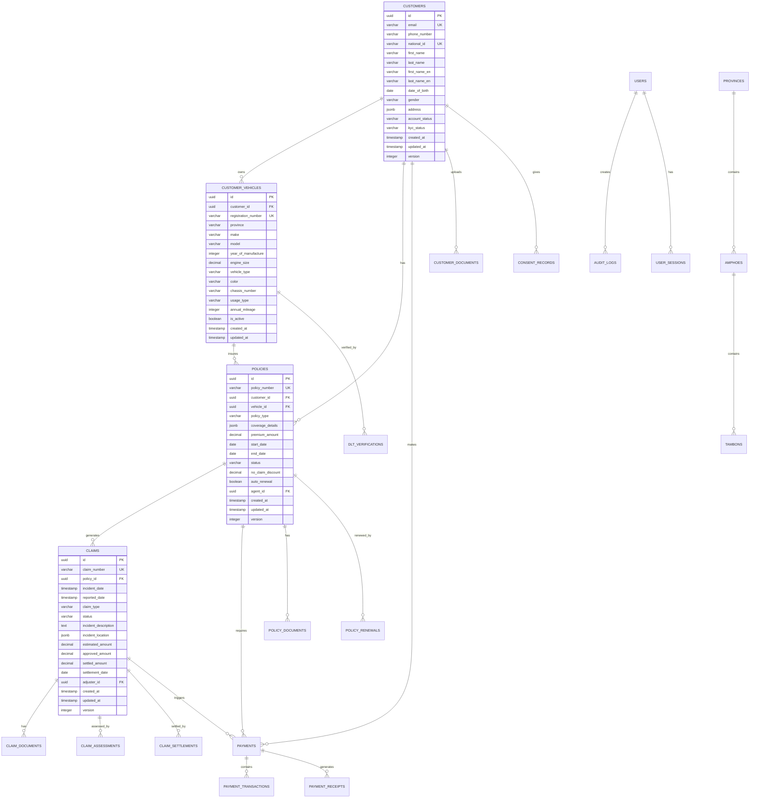

# Thai Auto Insurance Database Schema

## 1. Database Design Overview

### 1.1 Database Technology Stack
- **Primary Database**: PostgreSQL 15+
- **Connection Pool**: HikariCP
- **Migration Tool**: Flyway
- **ORM**: Hibernate/JPA
- **Cache Layer**: Redis 7.0+
- **Search Engine**: Elasticsearch 8.0+
- **Time Series**: InfluxDB (for metrics)

### 1.2 Design Principles
- **Normalization**: 3NF with selective denormalization for performance
- **Data Integrity**: Foreign key constraints and check constraints
- **Audit Trail**: All business tables include audit columns
- **Soft Deletes**: Critical data uses soft delete pattern
- **Partitioning**: Large tables partitioned by date
- **Encryption**: Sensitive data encrypted at field level
- **Localization**: Support for Thai and English data

### 1.3 Database Architecture

```
┌─────────────────────────────────────────────────────────────────┐
│                        Application Layer                        │
│  ┌─────────────────┐ ┌─────────────────┐ ┌─────────────────┐   │
│  │ Customer Service│ │ Policy Service  │ │ Claims Service  │   │
│  │ (Read/Write)    │ │ (Read/Write)    │ │ (Read/Write)    │   │
│  └─────────────────┘ └─────────────────┘ └─────────────────┘   │
└─────────────┬───────────────┬───────────────┬───────────────────┘
              │               │               │
┌─────────────┴───────────────┴───────────────┴───────────────────┐
│                      Connection Pool                           │
│              HikariCP (Max 20 connections)                     │
└─────────────┬───────────────┬───────────────┬───────────────────┘
              │               │               │
┌─────────────┴───────────────┴───────────────┴───────────────────┐
│                    PostgreSQL Cluster                          │
│  ┌─────────────────┐ ┌─────────────────┐ ┌─────────────────┐   │
│  │   Primary DB    │ │  Read Replica 1 │ │  Read Replica 2 │   │
│  │ (Read/Write)    │ │  (Read Only)    │ │  (Read Only)    │   │
│  │                 │ │                 │ │                 │   │
│  │ • Customers     │ │ • Reporting     │ │ • Analytics     │   │
│  │ • Policies      │ │ • Dashboard     │ │ • Search        │   │
│  │ • Claims        │ │ • History       │ │ • Export        │   │
│  │ • Payments      │ │                 │ │                 │   │
│  └─────────────────┘ └─────────────────┘ └─────────────────┘   │
└─────────────────────────────────────────────────────────────────┘
```

## 2. Entity Relationship Diagram



## 3. Core Database Schema

### 3.1 Customer Management Schema

#### Customers Table
```sql
CREATE TABLE customers (
    id UUID PRIMARY KEY DEFAULT gen_random_uuid(),
    email VARCHAR(255) NOT NULL UNIQUE,
    phone_number VARCHAR(20),
    national_id VARCHAR(13) UNIQUE,
    first_name VARCHAR(100) NOT NULL,
    last_name VARCHAR(100) NOT NULL,
    first_name_en VARCHAR(100),
    last_name_en VARCHAR(100),
    date_of_birth DATE,
    gender VARCHAR(10) CHECK (gender IN ('MALE', 'FEMALE', 'OTHER')),
    
    -- Address stored as JSONB for flexibility
    address JSONB,
    
    -- Account management
    account_status VARCHAR(20) DEFAULT 'ACTIVE' 
        CHECK (account_status IN ('ACTIVE', 'INACTIVE', 'SUSPENDED', 'CLOSED')),
    kyc_status VARCHAR(20) DEFAULT 'PENDING' 
        CHECK (kyc_status IN ('PENDING', 'IN_PROGRESS', 'VERIFIED', 'REJECTED')),
    preferred_language VARCHAR(5) DEFAULT 'th' 
        CHECK (preferred_language IN ('th', 'en')),
    
    -- Marketing preferences
    marketing_consent BOOLEAN DEFAULT FALSE,
    sms_notifications BOOLEAN DEFAULT TRUE,
    email_notifications BOOLEAN DEFAULT TRUE,
    
    -- Audit fields
    created_at TIMESTAMP WITH TIME ZONE DEFAULT NOW(),
    updated_at TIMESTAMP WITH TIME ZONE DEFAULT NOW(),
    created_by UUID,
    updated_by UUID,
    version INTEGER DEFAULT 0,
    
    -- Soft delete
    deleted_at TIMESTAMP WITH TIME ZONE,
    deleted_by UUID
);

-- Indexes for performance
CREATE INDEX idx_customers_email ON customers(email) WHERE deleted_at IS NULL;
CREATE INDEX idx_customers_national_id ON customers(national_id) WHERE deleted_at IS NULL;
CREATE INDEX idx_customers_phone ON customers(phone_number) WHERE deleted_at IS NULL;
CREATE INDEX idx_customers_status ON customers(account_status) WHERE deleted_at IS NULL;
CREATE INDEX idx_customers_kyc_status ON customers(kyc_status) WHERE deleted_at IS NULL;
CREATE INDEX idx_customers_created_at ON customers(created_at);

-- GIN index for address JSONB searches
CREATE INDEX idx_customers_address_gin ON customers USING GIN(address) WHERE deleted_at IS NULL;

-- Partial index for active customers
CREATE INDEX idx_customers_active ON customers(id) 
WHERE account_status = 'ACTIVE' AND deleted_at IS NULL;

-- Comments for documentation
COMMENT ON TABLE customers IS 'Customer master data with Thai-specific fields';
COMMENT ON COLUMN customers.national_id IS 'Thai national ID (13 digits)';
COMMENT ON COLUMN customers.address IS 'Thai address in JSON format with tambon, amphoe, province';
```

#### Customer Vehicles Table
```sql
CREATE TABLE customer_vehicles (
    id UUID PRIMARY KEY DEFAULT gen_random_uuid(),
    customer_id UUID NOT NULL REFERENCES customers(id),
    
    -- Vehicle identification
    registration_number VARCHAR(20) NOT NULL,
    province VARCHAR(100) NOT NULL,
    
    -- Vehicle details
    make VARCHAR(50) NOT NULL,
    model VARCHAR(100) NOT NULL,
    year_of_manufacture INTEGER NOT NULL 
        CHECK (year_of_manufacture >= 1950 AND year_of_manufacture <= EXTRACT(YEAR FROM NOW()) + 1),
    engine_size DECIMAL(4,1) CHECK (engine_size > 0),
    vehicle_type VARCHAR(50) NOT NULL 
        CHECK (vehicle_type IN ('SEDAN', 'HATCHBACK', 'SUV', 'PICKUP', 'VAN', 'MOTORCYCLE')),
    fuel_type VARCHAR(20) NOT NULL 
        CHECK (fuel_type IN ('GASOLINE', 'DIESEL', 'HYBRID', 'ELECTRIC', 'LPG', 'CNG')),
    color VARCHAR(30),
    chassis_number VARCHAR(50),
    
    -- Usage information
    usage_type VARCHAR(20) DEFAULT 'PERSONAL' 
        CHECK (usage_type IN ('PERSONAL', 'COMMERCIAL', 'TAXI', 'RENTAL')),
    annual_mileage INTEGER CHECK (annual_mileage > 0),
    parking_location VARCHAR(20) 
        CHECK (parking_location IN ('GARAGE', 'COVERED', 'STREET', 'PARKING_LOT')),
    
    -- Status
    is_active BOOLEAN DEFAULT TRUE,
    
    -- Audit fields
    created_at TIMESTAMP WITH TIME ZONE DEFAULT NOW(),
    updated_at TIMESTAMP WITH TIME ZONE DEFAULT NOW(),
    created_by UUID,
    updated_by UUID,
    
    -- Soft delete
    deleted_at TIMESTAMP WITH TIME ZONE,
    deleted_by UUID
);

-- Unique constraint for active vehicles
CREATE UNIQUE INDEX idx_customer_vehicles_registration 
ON customer_vehicles(registration_number, province) 
WHERE deleted_at IS NULL;

-- Indexes
CREATE INDEX idx_customer_vehicles_customer ON customer_vehicles(customer_id) WHERE deleted_at IS NULL;
CREATE INDEX idx_customer_vehicles_make_model ON customer_vehicles(make, model) WHERE deleted_at IS NULL;
CREATE INDEX idx_customer_vehicles_year ON customer_vehicles(year_of_manufacture) WHERE deleted_at IS NULL;
CREATE INDEX idx_customer_vehicles_active ON customer_vehicles(is_active) WHERE deleted_at IS NULL;

COMMENT ON TABLE customer_vehicles IS 'Customer-owned vehicles for insurance';
COMMENT ON COLUMN customer_vehicles.registration_number IS 'Thai vehicle registration number';
COMMENT ON COLUMN customer_vehicles.province IS 'Province where vehicle is registered';
```

#### DLT Verifications Table
```sql
CREATE TABLE dlt_verifications (
    id UUID PRIMARY KEY DEFAULT gen_random_uuid(),
    vehicle_id UUID NOT NULL REFERENCES customer_vehicles(id),
    
    -- Verification details
    verification_date TIMESTAMP WITH TIME ZONE NOT NULL DEFAULT NOW(),
    registration_valid BOOLEAN NOT NULL,
    tax_paid BOOLEAN NOT NULL,
    registration_expiry DATE,
    
    -- DLT response data
    dlt_response JSONB,
    dlt_reference_number VARCHAR(50),
    
    -- Verification metadata
    verified_by VARCHAR(50), -- system, agent, admin
    verification_method VARCHAR(20), -- api, manual, document
    
    -- Audit fields
    created_at TIMESTAMP WITH TIME ZONE DEFAULT NOW(),
    created_by UUID
);

-- Indexes
CREATE INDEX idx_dlt_verifications_vehicle ON dlt_verifications(vehicle_id);
CREATE INDEX idx_dlt_verifications_date ON dlt_verifications(verification_date);
CREATE INDEX idx_dlt_verifications_valid ON dlt_verifications(registration_valid);

COMMENT ON TABLE dlt_verifications IS 'Vehicle verifications from Department of Land Transport';
```

### 3.2 Policy Management Schema

#### Policies Table
```sql
CREATE TABLE policies (
    id UUID PRIMARY KEY DEFAULT gen_random_uuid(),
    policy_number VARCHAR(50) NOT NULL UNIQUE,
    
    -- Relationships
    customer_id UUID NOT NULL REFERENCES customers(id),
    vehicle_id UUID NOT NULL REFERENCES customer_vehicles(id),
    agent_id UUID REFERENCES users(id),
    
    -- Policy type and coverage
    policy_type VARCHAR(20) NOT NULL 
        CHECK (policy_type IN ('CMI', 'CLASS_1', 'CLASS_2', 'CLASS_3')),
    coverage_details JSONB NOT NULL,
    
    -- Premium and pricing
    base_premium DECIMAL(12,2) NOT NULL CHECK (base_premium > 0),
    discounts DECIMAL(12,2) DEFAULT 0,
    fees DECIMAL(12,2) DEFAULT 0,
    total_premium DECIMAL(12,2) NOT NULL CHECK (total_premium > 0),
    
    -- Policy period
    start_date DATE NOT NULL,
    end_date DATE NOT NULL,
    policy_period_months INTEGER NOT NULL DEFAULT 12 
        CHECK (policy_period_months IN (6, 12, 24, 36)),
    
    -- Status and renewals
    status VARCHAR(20) DEFAULT 'ACTIVE' 
        CHECK (status IN ('DRAFT', 'ACTIVE', 'EXPIRED', 'CANCELLED', 'SUSPENDED')),
    no_claim_discount DECIMAL(5,2) DEFAULT 0 
        CHECK (no_claim_discount >= 0 AND no_claim_discount <= 50),
    auto_renewal BOOLEAN DEFAULT FALSE,
    
    -- Previous policy for renewal tracking
    previous_policy_id UUID REFERENCES policies(id),
    renewal_count INTEGER DEFAULT 0,
    
    -- Payment information
    payment_plan VARCHAR(20) DEFAULT 'FULL' 
        CHECK (payment_plan IN ('FULL', 'INSTALLMENT_6', 'INSTALLMENT_12')),
    payment_frequency VARCHAR(20) DEFAULT 'ANNUAL' 
        CHECK (payment_frequency IN ('ANNUAL', 'SEMI_ANNUAL', 'MONTHLY')),
    
    -- Audit fields
    created_at TIMESTAMP WITH TIME ZONE DEFAULT NOW(),
    updated_at TIMESTAMP WITH TIME ZONE DEFAULT NOW(),
    created_by UUID,
    updated_by UUID,
    version INTEGER DEFAULT 0,
    
    -- Soft delete
    deleted_at TIMESTAMP WITH TIME ZONE,
    deleted_by UUID,
    
    CONSTRAINT chk_policy_dates CHECK (end_date > start_date),
    CONSTRAINT chk_policy_premium_calculation 
        CHECK (total_premium = base_premium - COALESCE(discounts, 0) + COALESCE(fees, 0))
);

-- Unique constraint for active policies per vehicle
CREATE UNIQUE INDEX idx_policies_vehicle_active 
ON policies(vehicle_id) 
WHERE status = 'ACTIVE' AND deleted_at IS NULL;

-- Performance indexes
CREATE INDEX idx_policies_customer ON policies(customer_id) WHERE deleted_at IS NULL;
CREATE INDEX idx_policies_number ON policies(policy_number) WHERE deleted_at IS NULL;
CREATE INDEX idx_policies_status ON policies(status) WHERE deleted_at IS NULL;
CREATE INDEX idx_policies_dates ON policies(start_date, end_date) WHERE deleted_at IS NULL;
CREATE INDEX idx_policies_expiry ON policies(end_date) 
WHERE status IN ('ACTIVE') AND deleted_at IS NULL;

-- Composite index for renewal queries
CREATE INDEX idx_policies_renewal_lookup 
ON policies(customer_id, end_date, status) 
WHERE status = 'ACTIVE' AND deleted_at IS NULL;

-- GIN index for coverage details JSON
CREATE INDEX idx_policies_coverage_gin ON policies USING GIN(coverage_details) 
WHERE deleted_at IS NULL;

-- Partial indexes for different policy types
CREATE INDEX idx_policies_cmi ON policies(id) 
WHERE policy_type = 'CMI' AND deleted_at IS NULL;
CREATE INDEX idx_policies_voluntary ON policies(id) 
WHERE policy_type IN ('CLASS_1', 'CLASS_2', 'CLASS_3') AND deleted_at IS NULL;

COMMENT ON TABLE policies IS 'Motor insurance policies';
COMMENT ON COLUMN policies.policy_type IS 'CMI=Compulsory Motor Insurance, CLASS_1/2/3=Voluntary insurance classes';
COMMENT ON COLUMN policies.coverage_details IS 'JSON structure containing coverage specifics per policy type';
```

#### Policy Documents Table
```sql
CREATE TABLE policy_documents (
    id UUID PRIMARY KEY DEFAULT gen_random_uuid(),
    policy_id UUID NOT NULL REFERENCES policies(id),
    
    -- Document details
    document_type VARCHAR(30) NOT NULL 
        CHECK (document_type IN ('POLICY', 'CERTIFICATE', 'SCHEDULE', 'ENDORSEMENT', 'RECEIPT')),
    document_name VARCHAR(255) NOT NULL,
    file_path VARCHAR(500) NOT NULL,
    file_size BIGINT,
    mime_type VARCHAR(100),
    
    -- Document metadata
    language VARCHAR(5) DEFAULT 'th' CHECK (language IN ('th', 'en')),
    is_official BOOLEAN DEFAULT TRUE,
    version_number INTEGER DEFAULT 1,
    
    -- Generation info
    generated_at TIMESTAMP WITH TIME ZONE DEFAULT NOW(),
    template_id UUID,
    template_version INTEGER,
    
    -- Audit fields
    created_at TIMESTAMP WITH TIME ZONE DEFAULT NOW(),
    created_by UUID
);

-- Indexes
CREATE INDEX idx_policy_documents_policy ON policy_documents(policy_id);
CREATE INDEX idx_policy_documents_type ON policy_documents(document_type);
CREATE INDEX idx_policy_documents_generated ON policy_documents(generated_at);

COMMENT ON TABLE policy_documents IS 'Generated policy documents and certificates';
```

#### Policy Renewals Table
```sql
CREATE TABLE policy_renewals (
    id UUID PRIMARY KEY DEFAULT gen_random_uuid(),
    
    -- Policy relationships
    original_policy_id UUID NOT NULL REFERENCES policies(id),
    renewed_policy_id UUID NOT NULL REFERENCES policies(id),
    
    -- Renewal details
    renewal_type VARCHAR(20) NOT NULL 
        CHECK (renewal_type IN ('AUTOMATIC', 'MANUAL', 'EARLY')),
    renewal_date TIMESTAMP WITH TIME ZONE NOT NULL DEFAULT NOW(),
    
    -- Changes made during renewal
    premium_change DECIMAL(12,2) DEFAULT 0,
    coverage_changes JSONB,
    discount_change DECIMAL(5,2) DEFAULT 0,
    
    -- Renewal metadata
    initiated_by VARCHAR(20) CHECK (initiated_by IN ('CUSTOMER', 'AGENT', 'SYSTEM')),
    renewal_channel VARCHAR(20) CHECK (renewal_channel IN ('WEB', 'MOBILE', 'AGENT', 'CALL_CENTER')),
    
    -- Audit fields
    created_at TIMESTAMP WITH TIME ZONE DEFAULT NOW(),
    created_by UUID
);

-- Indexes
CREATE INDEX idx_policy_renewals_original ON policy_renewals(original_policy_id);
CREATE INDEX idx_policy_renewals_renewed ON policy_renewals(renewed_policy_id);
CREATE INDEX idx_policy_renewals_date ON policy_renewals(renewal_date);

COMMENT ON TABLE policy_renewals IS 'Policy renewal history and relationships';
```

### 3.3 Claims Management Schema

#### Claims Table
```sql
CREATE TABLE claims (
    id UUID PRIMARY KEY DEFAULT gen_random_uuid(),
    claim_number VARCHAR(50) NOT NULL UNIQUE,
    
    -- Relationships
    policy_id UUID NOT NULL REFERENCES policies(id),
    adjuster_id UUID REFERENCES users(id),
    surveyor_id UUID REFERENCES users(id),
    
    -- Incident details
    incident_date TIMESTAMP WITH TIME ZONE NOT NULL,
    reported_date TIMESTAMP WITH TIME ZONE DEFAULT NOW(),
    claim_type VARCHAR(30) NOT NULL 
        CHECK (claim_type IN ('ACCIDENT', 'THEFT', 'FIRE', 'FLOOD', 'VANDALISM', 'NATURAL_DISASTER')),
    
    -- Status tracking
    status VARCHAR(20) DEFAULT 'REPORTED' 
        CHECK (status IN ('REPORTED', 'ASSIGNED', 'INVESTIGATING', 'ASSESSED', 'APPROVED', 'REJECTED', 'SETTLED', 'CLOSED')),
    sub_status VARCHAR(30),
    
    -- Descriptions
    incident_description TEXT NOT NULL,
    damage_description TEXT,
    injury_description TEXT,
    
    -- Location data
    incident_location JSONB,
    
    -- Financial amounts
    estimated_amount DECIMAL(12,2),
    assessed_amount DECIMAL(12,2),
    approved_amount DECIMAL(12,2),
    settled_amount DECIMAL(12,2),
    deductible_amount DECIMAL(12,2),
    
    -- Important dates
    assessment_date DATE,
    approval_date DATE,
    settlement_date DATE,
    closure_date DATE,
    
    -- External references
    police_report_number VARCHAR(50),
    court_case_number VARCHAR(50),
    
    -- Other party information (for accidents)
    other_party_info JSONB,
    
    -- Fraud indicators
    fraud_score DECIMAL(5,2) DEFAULT 0,
    fraud_flags JSONB,
    requires_investigation BOOLEAN DEFAULT FALSE,
    
    -- Service providers
    repair_shop_id UUID,
    hospital_id UUID,
    
    -- Audit fields
    created_at TIMESTAMP WITH TIME ZONE DEFAULT NOW(),
    updated_at TIMESTAMP WITH TIME ZONE DEFAULT NOW(),
    created_by UUID,
    updated_by UUID,
    version INTEGER DEFAULT 0,
    
    -- Soft delete
    deleted_at TIMESTAMP WITH TIME ZONE,
    deleted_by UUID,
    
    CONSTRAINT chk_claim_amounts CHECK (
        (estimated_amount IS NULL OR estimated_amount >= 0) AND
        (assessed_amount IS NULL OR assessed_amount >= 0) AND
        (approved_amount IS NULL OR approved_amount >= 0) AND
        (settled_amount IS NULL OR settled_amount >= 0)
    ),
    CONSTRAINT chk_claim_dates CHECK (
        reported_date >= incident_date AND
        (assessment_date IS NULL OR assessment_date >= incident_date::date) AND
        (settlement_date IS NULL OR settlement_date >= incident_date::date)
    )
);

-- Performance indexes
CREATE INDEX idx_claims_policy ON claims(policy_id) WHERE deleted_at IS NULL;
CREATE INDEX idx_claims_number ON claims(claim_number) WHERE deleted_at IS NULL;
CREATE INDEX idx_claims_status ON claims(status) WHERE deleted_at IS NULL;
CREATE INDEX idx_claims_type ON claims(claim_type) WHERE deleted_at IS NULL;
CREATE INDEX idx_claims_reported_date ON claims(reported_date);
CREATE INDEX idx_claims_incident_date ON claims(incident_date);

-- Composite indexes for common queries
CREATE INDEX idx_claims_status_reported ON claims(status, reported_date) WHERE deleted_at IS NULL;
CREATE INDEX idx_claims_adjuster_status ON claims(adjuster_id, status) 
WHERE adjuster_id IS NOT NULL AND deleted_at IS NULL;

-- JSON indexes
CREATE INDEX idx_claims_location_gin ON claims USING GIN(incident_location) WHERE deleted_at IS NULL;
CREATE INDEX idx_claims_fraud_gin ON claims USING GIN(fraud_flags) WHERE deleted_at IS NULL;

-- Partial indexes for active claims
CREATE INDEX idx_claims_active ON claims(id) 
WHERE status IN ('REPORTED', 'ASSIGNED', 'INVESTIGATING', 'ASSESSED', 'APPROVED') 
AND deleted_at IS NULL;

COMMENT ON TABLE claims IS 'Motor insurance claims';
COMMENT ON COLUMN claims.incident_location IS 'JSON with lat/lng and Thai address';
COMMENT ON COLUMN claims.other_party_info IS 'Details of other party in accidents';
COMMENT ON COLUMN claims.fraud_flags IS 'JSON array of fraud detection flags';
```

#### Claim Documents Table
```sql
CREATE TABLE claim_documents (
    id UUID PRIMARY KEY DEFAULT gen_random_uuid(),
    claim_id UUID NOT NULL REFERENCES claims(id),
    
    -- Document details
    document_type VARCHAR(30) NOT NULL 
        CHECK (document_type IN ('PHOTO', 'VIDEO', 'POLICE_REPORT', 'MEDICAL_REPORT', 'ESTIMATE', 'INVOICE', 'RECEIPT', 'OTHER')),
    document_category VARCHAR(20) 
        CHECK (document_category IN ('DAMAGE', 'SCENE', 'MEDICAL', 'LEGAL', 'FINANCIAL')),
    
    -- File information
    original_filename VARCHAR(255) NOT NULL,
    file_path VARCHAR(500) NOT NULL,
    file_size BIGINT,
    mime_type VARCHAR(100),
    
    -- Document metadata
    description TEXT,
    is_sensitive BOOLEAN DEFAULT FALSE,
    is_required BOOLEAN DEFAULT FALSE,
    
    -- Processing status
    upload_status VARCHAR(20) DEFAULT 'PENDING' 
        CHECK (upload_status IN ('PENDING', 'PROCESSED', 'APPROVED', 'REJECTED')),
    review_notes TEXT,
    
    -- OCR and extraction
    extracted_text TEXT,
    extracted_data JSONB,
    
    -- Audit fields
    uploaded_at TIMESTAMP WITH TIME ZONE DEFAULT NOW(),
    uploaded_by UUID,
    reviewed_at TIMESTAMP WITH TIME ZONE,
    reviewed_by UUID
);

-- Indexes
CREATE INDEX idx_claim_documents_claim ON claim_documents(claim_id);
CREATE INDEX idx_claim_documents_type ON claim_documents(document_type);
CREATE INDEX idx_claim_documents_category ON claim_documents(document_category);
CREATE INDEX idx_claim_documents_status ON claim_documents(upload_status);
CREATE INDEX idx_claim_documents_uploaded ON claim_documents(uploaded_at);

-- Full-text search index for extracted text
CREATE INDEX idx_claim_documents_text ON claim_documents USING GIN(to_tsvector('english', extracted_text));

COMMENT ON TABLE claim_documents IS 'Documents uploaded for claims processing';
```

#### Claim Assessments Table
```sql
CREATE TABLE claim_assessments (
    id UUID PRIMARY KEY DEFAULT gen_random_uuid(),
    claim_id UUID NOT NULL REFERENCES claims(id),
    
    -- Assessor information
    assessor_id UUID NOT NULL REFERENCES users(id),
    assessor_type VARCHAR(20) NOT NULL 
        CHECK (assessor_type IN ('SURVEYOR', 'ADJUSTER', 'SPECIALIST')),
    
    -- Assessment details
    assessment_date TIMESTAMP WITH TIME ZONE NOT NULL,
    assessment_type VARCHAR(20) NOT NULL 
        CHECK (assessment_type IN ('INITIAL', 'DETAILED', 'RE_ASSESSMENT', 'FINAL')),
    
    -- Damage assessment
    damage_assessment JSONB NOT NULL,
    repair_estimates JSONB,
    total_loss_assessment BOOLEAN DEFAULT FALSE,
    salvage_value DECIMAL(12,2),
    
    -- Liability assessment
    liability_percentage DECIMAL(5,2) CHECK (liability_percentage >= 0 AND liability_percentage <= 100),
    contributing_factors JSONB,
    
    -- Recommendations
    recommended_amount DECIMAL(12,2),
    recommended_action VARCHAR(30) 
        CHECK (recommended_action IN ('APPROVE', 'REJECT', 'INVESTIGATE', 'REQUEST_MORE_INFO')),
    assessment_notes TEXT,
    
    -- Quality assurance
    qa_reviewed BOOLEAN DEFAULT FALSE,
    qa_reviewer_id UUID REFERENCES users(id),
    qa_notes TEXT,
    
    -- Audit fields
    created_at TIMESTAMP WITH TIME ZONE DEFAULT NOW(),
    created_by UUID,
    version INTEGER DEFAULT 1
);

-- Indexes
CREATE INDEX idx_claim_assessments_claim ON claim_assessments(claim_id);
CREATE INDEX idx_claim_assessments_assessor ON claim_assessments(assessor_id);
CREATE INDEX idx_claim_assessments_date ON claim_assessments(assessment_date);
CREATE INDEX idx_claim_assessments_type ON claim_assessments(assessment_type);

COMMENT ON TABLE claim_assessments IS 'Professional assessments of claims';
```

### 3.4 Payment Management Schema

#### Payments Table
```sql
CREATE TABLE payments (
    id UUID PRIMARY KEY DEFAULT gen_random_uuid(),
    
    -- Relationships
    policy_id UUID REFERENCES policies(id),
    claim_id UUID REFERENCES claims(id),
    customer_id UUID NOT NULL REFERENCES customers(id),
    
    -- Payment classification
    payment_type VARCHAR(20) NOT NULL 
        CHECK (payment_type IN ('PREMIUM', 'INSTALLMENT', 'CLAIM_SETTLEMENT', 'REFUND', 'FEE')),
    payment_direction VARCHAR(10) NOT NULL DEFAULT 'INCOMING' 
        CHECK (payment_direction IN ('INCOMING', 'OUTGOING')),
    
    -- Payment amounts
    amount DECIMAL(12,2) NOT NULL CHECK (amount > 0),
    currency VARCHAR(3) DEFAULT 'THB' CHECK (currency IN ('THB', 'USD', 'EUR')),
    fees DECIMAL(12,2) DEFAULT 0,
    total_amount DECIMAL(12,2) NOT NULL CHECK (total_amount > 0),
    
    -- Payment method
    payment_method VARCHAR(30) NOT NULL 
        CHECK (payment_method IN ('CREDIT_CARD', 'DEBIT_CARD', 'BANK_TRANSFER', 'PROMPTPAY', 'TRUEMONEY', 'RABBIT_LINE_PAY', 'K_PLUS', 'CASH')),
    payment_channel VARCHAR(20) 
        CHECK (payment_channel IN ('WEB', 'MOBILE', 'AGENT', 'CALL_CENTER', 'BANK', 'ATM')),
    
    -- Payment status
    payment_status VARCHAR(20) DEFAULT 'PENDING' 
        CHECK (payment_status IN ('PENDING', 'PROCESSING', 'SUCCESS', 'FAILED', 'CANCELLED', 'REFUNDED', 'PARTIAL_REFUND')),
    
    -- Transaction details
    transaction_reference VARCHAR(100),
    gateway_transaction_id VARCHAR(100),
    authorization_code VARCHAR(50),
    
    -- Important dates
    payment_date TIMESTAMP WITH TIME ZONE,
    due_date DATE,
    processed_at TIMESTAMP WITH TIME ZONE,
    
    -- Installment information
    installment_number INTEGER,
    total_installments INTEGER,
    
    -- Payment gateway information
    gateway_provider VARCHAR(50),
    gateway_response JSONB,
    
    -- Card information (tokenized/masked)
    card_last_four VARCHAR(4),
    card_type VARCHAR(20),
    card_token VARCHAR(255),
    
    -- Bank transfer information
    bank_code VARCHAR(10),
    bank_account_number VARCHAR(50), -- masked
    
    -- Reconciliation
    reconciliation_status VARCHAR(20) DEFAULT 'PENDING' 
        CHECK (reconciliation_status IN ('PENDING', 'MATCHED', 'UNMATCHED', 'DISPUTED')),
    reconciled_at TIMESTAMP WITH TIME ZONE,
    
    -- Audit fields
    created_at TIMESTAMP WITH TIME ZONE DEFAULT NOW(),
    updated_at TIMESTAMP WITH TIME ZONE DEFAULT NOW(),
    created_by UUID,
    updated_by UUID,
    version INTEGER DEFAULT 0,
    
    CONSTRAINT chk_payment_amounts CHECK (total_amount = amount + COALESCE(fees, 0)),
    CONSTRAINT chk_payment_installments CHECK (
        (installment_number IS NULL AND total_installments IS NULL) OR
        (installment_number > 0 AND total_installments > 0 AND installment_number <= total_installments)
    )
);

-- Performance indexes
CREATE INDEX idx_payments_customer ON payments(customer_id);
CREATE INDEX idx_payments_policy ON payments(policy_id);
CREATE INDEX idx_payments_claim ON payments(claim_id);
CREATE INDEX idx_payments_status ON payments(payment_status);
CREATE INDEX idx_payments_method ON payments(payment_method);
CREATE INDEX idx_payments_date ON payments(payment_date);
CREATE INDEX idx_payments_due_date ON payments(due_date);
CREATE INDEX idx_payments_reference ON payments(transaction_reference);

-- Composite indexes for common queries
CREATE INDEX idx_payments_customer_status ON payments(customer_id, payment_status);
CREATE INDEX idx_payments_due_status ON payments(due_date, payment_status) 
WHERE due_date IS NOT NULL;
CREATE INDEX idx_payments_reconciliation ON payments(reconciliation_status, processed_at);

-- Partial indexes for active payments
CREATE INDEX idx_payments_pending ON payments(id) 
WHERE payment_status IN ('PENDING', 'PROCESSING');

COMMENT ON TABLE payments IS 'All payment transactions including premiums and claim settlements';
COMMENT ON COLUMN payments.gateway_response IS 'Full gateway response for debugging';
```

#### Payment Receipts Table
```sql
CREATE TABLE payment_receipts (
    id UUID PRIMARY KEY DEFAULT gen_random_uuid(),
    payment_id UUID NOT NULL REFERENCES payments(id),
    
    -- Receipt details
    receipt_number VARCHAR(50) NOT NULL UNIQUE,
    receipt_type VARCHAR(20) NOT NULL 
        CHECK (receipt_type IN ('PAYMENT', 'TAX_INVOICE', 'RECEIPT')),
    
    -- Document information
    file_path VARCHAR(500),
    file_format VARCHAR(10) DEFAULT 'PDF',
    
    -- Tax information
    tax_invoice_number VARCHAR(50),
    vat_amount DECIMAL(12,2),
    withholding_tax DECIMAL(12,2),
    
    -- Issue details
    issued_date DATE NOT NULL DEFAULT CURRENT_DATE,
    issued_by UUID,
    language VARCHAR(5) DEFAULT 'th' CHECK (language IN ('th', 'en')),
    
    -- Delivery information
    delivery_method VARCHAR(20) 
        CHECK (delivery_method IN ('EMAIL', 'SMS', 'POSTAL', 'DOWNLOAD')),
    delivered_at TIMESTAMP WITH TIME ZONE,
    
    -- Audit fields
    created_at TIMESTAMP WITH TIME ZONE DEFAULT NOW(),
    created_by UUID
);

-- Indexes
CREATE INDEX idx_payment_receipts_payment ON payment_receipts(payment_id);
CREATE INDEX idx_payment_receipts_number ON payment_receipts(receipt_number);
CREATE INDEX idx_payment_receipts_type ON payment_receipts(receipt_type);
CREATE INDEX idx_payment_receipts_issued ON payment_receipts(issued_date);

COMMENT ON TABLE payment_receipts IS 'Payment receipts and tax invoices';
```

### 3.5 User Management and Security Schema

#### Users Table
```sql
CREATE TABLE users (
    id UUID PRIMARY KEY DEFAULT gen_random_uuid(),
    
    -- Basic information
    username VARCHAR(100) NOT NULL UNIQUE,
    email VARCHAR(255) NOT NULL UNIQUE,
    phone_number VARCHAR(20),
    
    -- Authentication
    password_hash VARCHAR(255) NOT NULL,
    password_changed_at TIMESTAMP WITH TIME ZONE DEFAULT NOW(),
    password_history JSONB, -- last 5 password hashes
    
    -- Personal information
    first_name VARCHAR(100) NOT NULL,
    last_name VARCHAR(100) NOT NULL,
    employee_id VARCHAR(50),
    
    -- Role and permissions
    role VARCHAR(20) NOT NULL 
        CHECK (role IN ('CUSTOMER', 'AGENT', 'ADJUSTER', 'SURVEYOR', 'UNDERWRITER', 'ADMIN', 'SUPER_ADMIN')),
    permissions JSONB,
    department VARCHAR(50),
    
    -- Account status
    account_status VARCHAR(20) DEFAULT 'ACTIVE' 
        CHECK (account_status IN ('ACTIVE', 'INACTIVE', 'LOCKED', 'SUSPENDED', 'TERMINATED')),
    email_verified BOOLEAN DEFAULT FALSE,
    phone_verified BOOLEAN DEFAULT FALSE,
    
    -- Security settings
    two_factor_enabled BOOLEAN DEFAULT FALSE,
    two_factor_secret VARCHAR(255),
    failed_login_attempts INTEGER DEFAULT 0,
    locked_until TIMESTAMP WITH TIME ZONE,
    
    -- Session management
    last_login_at TIMESTAMP WITH TIME ZONE,
    last_login_ip INET,
    current_session_id VARCHAR(255),
    
    -- Profile information
    profile_picture_url VARCHAR(500),
    preferred_language VARCHAR(5) DEFAULT 'th' CHECK (preferred_language IN ('th', 'en')),
    timezone VARCHAR(50) DEFAULT 'Asia/Bangkok',
    
    -- Audit fields
    created_at TIMESTAMP WITH TIME ZONE DEFAULT NOW(),
    updated_at TIMESTAMP WITH TIME ZONE DEFAULT NOW(),
    created_by UUID,
    updated_by UUID,
    version INTEGER DEFAULT 0,
    
    -- Soft delete
    deleted_at TIMESTAMP WITH TIME ZONE,
    deleted_by UUID
);

-- Indexes
CREATE INDEX idx_users_username ON users(username) WHERE deleted_at IS NULL;
CREATE INDEX idx_users_email ON users(email) WHERE deleted_at IS NULL;
CREATE INDEX idx_users_role ON users(role) WHERE deleted_at IS NULL;
CREATE INDEX idx_users_status ON users(account_status) WHERE deleted_at IS NULL;
CREATE INDEX idx_users_last_login ON users(last_login_at);
CREATE INDEX idx_users_department ON users(department) WHERE deleted_at IS NULL;

COMMENT ON TABLE users IS 'System users including customers, agents, and staff';
```

#### User Sessions Table
```sql
CREATE TABLE user_sessions (
    id UUID PRIMARY KEY DEFAULT gen_random_uuid(),
    user_id UUID NOT NULL REFERENCES users(id),
    
    -- Session details
    session_id VARCHAR(255) NOT NULL UNIQUE,
    refresh_token_hash VARCHAR(255),
    
    -- Session metadata
    ip_address INET NOT NULL,
    user_agent TEXT,
    device_info JSONB,
    location_info JSONB,
    
    -- Session status
    is_active BOOLEAN DEFAULT TRUE,
    login_method VARCHAR(20) CHECK (login_method IN ('PASSWORD', 'SSO', 'TOKEN', 'BIOMETRIC')),
    
    -- Timing
    created_at TIMESTAMP WITH TIME ZONE DEFAULT NOW(),
    last_activity_at TIMESTAMP WITH TIME ZONE DEFAULT NOW(),
    expires_at TIMESTAMP WITH TIME ZONE NOT NULL,
    terminated_at TIMESTAMP WITH TIME ZONE,
    termination_reason VARCHAR(50)
);

-- Indexes
CREATE INDEX idx_user_sessions_user ON user_sessions(user_id);
CREATE INDEX idx_user_sessions_session_id ON user_sessions(session_id);
CREATE INDEX idx_user_sessions_active ON user_sessions(is_active, expires_at);
CREATE INDEX idx_user_sessions_cleanup ON user_sessions(expires_at) WHERE NOT is_active;

COMMENT ON TABLE user_sessions IS 'Active user sessions for security tracking';
```

### 3.6 System and Reference Data Schema

#### Audit Logs Table
```sql
CREATE TABLE audit_logs (
    id BIGSERIAL,
    
    -- What was changed
    table_name VARCHAR(50) NOT NULL,
    record_id UUID NOT NULL,
    operation VARCHAR(10) NOT NULL CHECK (operation IN ('INSERT', 'UPDATE', 'DELETE')),
    
    -- Change details
    old_values JSONB,
    new_values JSONB,
    changed_fields TEXT[],
    
    -- Who and when
    user_id UUID,
    user_role VARCHAR(20),
    ip_address INET,
    user_agent TEXT,
    
    -- Context
    business_context VARCHAR(100), -- e.g., 'POLICY_CREATION', 'CLAIM_SETTLEMENT'
    request_id UUID,
    
    -- Timing
    timestamp TIMESTAMP WITH TIME ZONE DEFAULT NOW()
    
) PARTITION BY RANGE (timestamp);

-- Create partitions for each month
CREATE TABLE audit_logs_y2024m12 PARTITION OF audit_logs
FOR VALUES FROM ('2024-12-01') TO ('2025-01-01');

CREATE TABLE audit_logs_y2025m01 PARTITION OF audit_logs
FOR VALUES FROM ('2025-01-01') TO ('2025-02-01');

-- Indexes on partitioned table
CREATE INDEX idx_audit_logs_table_record ON audit_logs(table_name, record_id);
CREATE INDEX idx_audit_logs_user ON audit_logs(user_id, timestamp);
CREATE INDEX idx_audit_logs_timestamp ON audit_logs(timestamp);
CREATE INDEX idx_audit_logs_operation ON audit_logs(operation, timestamp);

COMMENT ON TABLE audit_logs IS 'Complete audit trail of all data changes';
```

#### Thai Geographic Data Tables
```sql
-- Provinces table
CREATE TABLE provinces (
    id SERIAL PRIMARY KEY,
    province_code VARCHAR(2) NOT NULL UNIQUE,
    name_th VARCHAR(100) NOT NULL,
    name_en VARCHAR(100) NOT NULL,
    region VARCHAR(20) NOT NULL CHECK (region IN ('CENTRAL', 'NORTH', 'NORTHEAST', 'SOUTH', 'EAST', 'WEST')),
    is_active BOOLEAN DEFAULT TRUE
);

-- Amphoes (Districts) table
CREATE TABLE amphoes (
    id SERIAL PRIMARY KEY,
    amphoe_code VARCHAR(4) NOT NULL UNIQUE,
    province_id INTEGER NOT NULL REFERENCES provinces(id),
    name_th VARCHAR(100) NOT NULL,
    name_en VARCHAR(100) NOT NULL,
    is_active BOOLEAN DEFAULT TRUE
);

-- Tambons (Sub-districts) table
CREATE TABLE tambons (
    id SERIAL PRIMARY KEY,
    tambon_code VARCHAR(6) NOT NULL UNIQUE,
    amphoe_id INTEGER NOT NULL REFERENCES amphoes(id),
    name_th VARCHAR(100) NOT NULL,
    name_en VARCHAR(100) NOT NULL,
    postal_code VARCHAR(5),
    is_active BOOLEAN DEFAULT TRUE
);

-- Indexes for geographic data
CREATE INDEX idx_amphoes_province ON amphoes(province_id);
CREATE INDEX idx_tambons_amphoe ON tambons(amphoe_id);
CREATE INDEX idx_tambons_postal_code ON tambons(postal_code);

-- Insert sample data for Bangkok
INSERT INTO provinces (province_code, name_th, name_en, region) 
VALUES ('10', 'กรุงเทพมหานคร', 'Bangkok', 'CENTRAL');

INSERT INTO amphoes (amphoe_code, province_id, name_th, name_en) 
VALUES ('1001', 1, 'พระนคร', 'Phra Nakhon'),
       ('1002', 1, 'ดุสิต', 'Dusit'),
       ('1003', 1, 'หนองจอก', 'Nong Chok');

INSERT INTO tambons (tambon_code, amphoe_id, name_th, name_en, postal_code)
VALUES ('100101', 1, 'พระบรมมหาราชวัง', 'Phra Borom Maha Ratchawang', '10200'),
       ('100102', 1, 'วัดราชบพิธ', 'Wat Ratchabophit', '10200');

COMMENT ON TABLE provinces IS 'Thai provinces master data';
COMMENT ON TABLE amphoes IS 'Thai districts (amphoe) master data';
COMMENT ON TABLE tambons IS 'Thai sub-districts (tambon) master data';
```

#### System Configuration Tables
```sql
CREATE TABLE system_configurations (
    id UUID PRIMARY KEY DEFAULT gen_random_uuid(),
    
    -- Configuration identity
    config_key VARCHAR(100) NOT NULL UNIQUE,
    config_category VARCHAR(50) NOT NULL,
    
    -- Configuration values
    config_value TEXT NOT NULL,
    config_type VARCHAR(20) NOT NULL 
        CHECK (config_type IN ('STRING', 'INTEGER', 'DECIMAL', 'BOOLEAN', 'JSON')),
    
    -- Metadata
    description TEXT,
    is_sensitive BOOLEAN DEFAULT FALSE,
    is_readonly BOOLEAN DEFAULT FALSE,
    
    -- Environment
    environment VARCHAR(20) DEFAULT 'ALL' 
        CHECK (environment IN ('ALL', 'DEVELOPMENT', 'STAGING', 'PRODUCTION')),
    
    -- Validation
    validation_regex VARCHAR(500),
    min_value DECIMAL,
    max_value DECIMAL,
    
    -- Audit fields
    created_at TIMESTAMP WITH TIME ZONE DEFAULT NOW(),
    updated_at TIMESTAMP WITH TIME ZONE DEFAULT NOW(),
    created_by UUID,
    updated_by UUID,
    version INTEGER DEFAULT 1
);

-- Indexes
CREATE INDEX idx_system_configurations_key ON system_configurations(config_key);
CREATE INDEX idx_system_configurations_category ON system_configurations(config_category);
CREATE INDEX idx_system_configurations_environment ON system_configurations(environment);

-- Insert default configurations
INSERT INTO system_configurations (config_key, config_category, config_value, config_type, description) VALUES
('POLICY_GRACE_PERIOD_DAYS', 'POLICY', '30', 'INTEGER', 'Grace period for policy renewal in days'),
('MAX_CLAIM_AMOUNT', 'CLAIMS', '5000000.00', 'DECIMAL', 'Maximum claim amount in THB'),
('DEFAULT_NO_CLAIM_DISCOUNT', 'POLICY', '10.0', 'DECIMAL', 'Default no-claim discount percentage'),
('PAYMENT_TIMEOUT_MINUTES', 'PAYMENT', '15', 'INTEGER', 'Payment gateway timeout in minutes'),
('SMS_OTP_EXPIRY_MINUTES', 'SECURITY', '5', 'INTEGER', 'SMS OTP expiry time in minutes'),
('MAX_LOGIN_ATTEMPTS', 'SECURITY', '5', 'INTEGER', 'Maximum failed login attempts before account lock'),
('SESSION_TIMEOUT_HOURS', 'SECURITY', '8', 'INTEGER', 'User session timeout in hours');

COMMENT ON TABLE system_configurations IS 'Application configuration parameters';
```

## 4. Data Migration Strategy

### 4.1 Migration Scripts Structure
```sql
-- Migration versioning follows Flyway convention
-- V1__Initial_schema.sql
-- V2__Add_customer_indices.sql
-- V3__Alter_policy_table.sql
-- etc.

-- Example migration script header
-- Description: Add support for electronic signatures
-- Author: System Architecture Team
-- Date: 2024-12-27
-- Dependencies: V15__Policy_documents_table.sql

BEGIN;

-- Add electronic signature support to policy documents
ALTER TABLE policy_documents 
ADD COLUMN electronic_signature JSONB,
ADD COLUMN signature_timestamp TIMESTAMP WITH TIME ZONE,
ADD COLUMN signature_ip INET;

-- Create index for signature queries
CREATE INDEX idx_policy_documents_signature 
ON policy_documents(signature_timestamp) 
WHERE electronic_signature IS NOT NULL;

-- Update configuration for e-signature feature
INSERT INTO system_configurations (config_key, config_category, config_value, config_type, description) 
VALUES ('ENABLE_ELECTRONIC_SIGNATURE', 'POLICY', 'true', 'BOOLEAN', 'Enable electronic signature for policy documents');

COMMIT;
```

### 4.2 Data Import/Export Procedures
```sql
-- Procedure for customer data export (PDPA compliance)
CREATE OR REPLACE FUNCTION export_customer_data(customer_uuid UUID)
RETURNS JSON AS $$
DECLARE
    result JSON;
BEGIN
    SELECT json_build_object(
        'customer', (
            SELECT to_json(c.*) 
            FROM customers c 
            WHERE c.id = customer_uuid
        ),
        'vehicles', (
            SELECT json_agg(to_json(cv.*))
            FROM customer_vehicles cv
            WHERE cv.customer_id = customer_uuid
            AND cv.deleted_at IS NULL
        ),
        'policies', (
            SELECT json_agg(to_json(p.*))
            FROM policies p
            WHERE p.customer_id = customer_uuid
            AND p.deleted_at IS NULL
        ),
        'claims', (
            SELECT json_agg(to_json(c.*))
            FROM claims c
            JOIN policies p ON c.policy_id = p.id
            WHERE p.customer_id = customer_uuid
            AND c.deleted_at IS NULL
        ),
        'payments', (
            SELECT json_agg(to_json(pay.*))
            FROM payments pay
            WHERE pay.customer_id = customer_uuid
        )
    ) INTO result;
    
    -- Log the export for audit purposes
    INSERT INTO audit_logs (table_name, record_id, operation, business_context, user_id)
    VALUES ('customers', customer_uuid, 'EXPORT', 'DATA_PORTABILITY', customer_uuid);
    
    RETURN result;
END;
$$ LANGUAGE plpgsql SECURITY DEFINER;

-- Procedure for customer data anonymization (Right to erasure)
CREATE OR REPLACE FUNCTION anonymize_customer_data(customer_uuid UUID)
RETURNS BOOLEAN AS $$
BEGIN
    -- Update customer record with anonymized data
    UPDATE customers 
    SET 
        email = 'anonymized_' || id::text || '@deleted.local',
        phone_number = NULL,
        national_id = NULL,
        first_name = 'ANONYMIZED',
        last_name = 'DATA',
        first_name_en = 'ANONYMIZED',
        last_name_en = 'DATA',
        date_of_birth = NULL,
        address = NULL,
        deleted_at = NOW(),
        deleted_by = customer_uuid
    WHERE id = customer_uuid;
    
    -- Anonymize related data while preserving business requirements
    UPDATE customer_vehicles 
    SET chassis_number = 'ANONYMIZED'
    WHERE customer_id = customer_uuid;
    
    -- Log the anonymization
    INSERT INTO audit_logs (table_name, record_id, operation, business_context, user_id)
    VALUES ('customers', customer_uuid, 'ANONYMIZE', 'RIGHT_TO_ERASURE', customer_uuid);
    
    RETURN TRUE;
END;
$$ LANGUAGE plpgsql SECURITY DEFINER;
```

## 5. Performance Optimization

### 5.1 Query Optimization Examples
```sql
-- Optimized query for customer policy dashboard
EXPLAIN (ANALYZE, BUFFERS) 
SELECT 
    p.id,
    p.policy_number,
    p.policy_type,
    p.status,
    p.start_date,
    p.end_date,
    p.total_premium,
    cv.registration_number,
    cv.make,
    cv.model,
    (
        SELECT COUNT(*) 
        FROM claims c 
        WHERE c.policy_id = p.id 
        AND c.deleted_at IS NULL
    ) as claim_count,
    (
        SELECT SUM(settled_amount) 
        FROM claims c 
        WHERE c.policy_id = p.id 
        AND c.status = 'SETTLED'
        AND c.deleted_at IS NULL
    ) as total_claims_settled
FROM policies p
JOIN customer_vehicles cv ON p.vehicle_id = cv.id
WHERE p.customer_id = $1 
    AND p.deleted_at IS NULL
    AND cv.deleted_at IS NULL
ORDER BY p.start_date DESC;

-- Index recommendation for above query
CREATE INDEX CONCURRENTLY idx_policies_customer_start_date 
ON policies(customer_id, start_date DESC) 
WHERE deleted_at IS NULL;
```

### 5.2 Partitioning Examples
```sql
-- Partition payments table by month for better performance
CREATE TABLE payments_partitioned (
    LIKE payments INCLUDING ALL
) PARTITION BY RANGE (created_at);

-- Create monthly partitions
CREATE TABLE payments_y2024m12 PARTITION OF payments_partitioned
FOR VALUES FROM ('2024-12-01') TO ('2025-01-01');

CREATE TABLE payments_y2025m01 PARTITION OF payments_partitioned
FOR VALUES FROM ('2025-01-01') TO ('2025-02-01');

-- Migrate existing data
INSERT INTO payments_partitioned SELECT * FROM payments;

-- Create automated partition maintenance
CREATE OR REPLACE FUNCTION create_monthly_partition(table_name TEXT, start_date DATE)
RETURNS VOID AS $$
DECLARE
    partition_name TEXT;
    end_date DATE;
BEGIN
    partition_name := table_name || '_y' || EXTRACT(YEAR FROM start_date) || 'm' || LPAD(EXTRACT(MONTH FROM start_date)::TEXT, 2, '0');
    end_date := start_date + INTERVAL '1 month';
    
    EXECUTE format('CREATE TABLE %I PARTITION OF %I FOR VALUES FROM (%L) TO (%L)',
                   partition_name, table_name, start_date, end_date);
END;
$$ LANGUAGE plpgsql;
```

### 5.3 Connection Pool Configuration
```yaml
# HikariCP configuration for production
spring:
  datasource:
    hikari:
      maximum-pool-size: 20
      minimum-idle: 5
      connection-timeout: 30000
      idle-timeout: 600000
      max-lifetime: 1800000
      leak-detection-threshold: 60000
      
      # Performance tuning
      auto-commit: false
      connection-test-query: SELECT 1
      validation-timeout: 3000
      
      # Monitoring
      register-mbeans: true
      
      # Connection properties for PostgreSQL
      data-source-properties:
        cachePrepStmts: true
        prepStmtCacheSize: 250
        prepStmtCacheSqlLimit: 2048
        useServerPrepStmts: true
        useLocalSessionState: true
        rewriteBatchedStatements: true
        cacheResultSetMetadata: true
        cacheServerConfiguration: true
        elideSetAutoCommits: true
        maintainTimeStats: false
```

## 6. Backup and Recovery Strategy

### 6.1 Backup Configuration
```bash
#!/bin/bash
# Automated backup script

# Configuration
DB_HOST="auto-insurance-db-primary.internal"
DB_USER="backup_user"
DB_NAME="auto_insurance"
BACKUP_DIR="/backups"
S3_BUCKET="auto-insurance-backups"

# Full backup (daily at 2 AM)
perform_full_backup() {
    TIMESTAMP=$(date +%Y%m%d_%H%M%S)
    BACKUP_FILE="${BACKUP_DIR}/full_backup_${TIMESTAMP}.dump"
    
    # Create backup with compression
    pg_dump -h $DB_HOST -U $DB_USER -d $DB_NAME \
        --format=custom \
        --compress=9 \
        --no-owner \
        --no-privileges \
        --verbose \
        --file=$BACKUP_FILE
    
    # Verify backup integrity
    pg_restore --list $BACKUP_FILE > /dev/null
    if [ $? -eq 0 ]; then
        echo "Backup verification successful"
        
        # Upload to S3
        aws s3 cp $BACKUP_FILE s3://$S3_BUCKET/daily/
        
        # Clean up local backups older than 7 days
        find $BACKUP_DIR -name "full_backup_*.dump" -mtime +7 -delete
    else
        echo "Backup verification failed!"
        exit 1
    fi
}

# Incremental backup using WAL archiving
configure_wal_archiving() {
    # PostgreSQL configuration for WAL archiving
    cat >> /etc/postgresql/15/main/postgresql.conf << EOF
    
    # WAL archiving configuration
    wal_level = replica
    archive_mode = on
    archive_command = 'aws s3 cp %p s3://$S3_BUCKET/wal/%f'
    archive_timeout = 300  # 5 minutes
    
    # Retention
    max_wal_size = 2GB
    min_wal_size = 1GB
    
EOF
}

# Point-in-time recovery procedure
perform_pitr() {
    local recovery_time=$1
    local recovery_dir="/var/lib/postgresql/15/recovery"
    
    echo "Performing point-in-time recovery to: $recovery_time"
    
    # Stop PostgreSQL
    systemctl stop postgresql
    
    # Restore base backup
    rm -rf /var/lib/postgresql/15/main/*
    pg_restore -d postgres --create --jobs=4 \
        s3://$S3_BUCKET/daily/latest_full_backup.dump
    
    # Configure recovery
    cat > $recovery_dir/recovery.conf << EOF
restore_command = 'aws s3 cp s3://$S3_BUCKET/wal/%f %p'
recovery_target_time = '$recovery_time'
recovery_target_action = 'promote'
EOF
    
    # Start PostgreSQL in recovery mode
    systemctl start postgresql
}
```

### 6.2 Disaster Recovery Procedures
```sql
-- Database health check procedures
CREATE OR REPLACE FUNCTION check_database_health()
RETURNS TABLE (
    check_name TEXT,
    status TEXT,
    details TEXT
) AS $$
BEGIN
    -- Check disk space
    RETURN QUERY
    SELECT 'Disk Space'::TEXT, 
           CASE WHEN pg_size_pretty(pg_database_size(current_database()))::TEXT ~ 'GB$' 
                AND substring(pg_size_pretty(pg_database_size(current_database())), 1, position(' ' in pg_size_pretty(pg_database_size(current_database()))) - 1)::numeric > 80
           THEN 'WARNING' ELSE 'OK' END,
           'Database size: ' || pg_size_pretty(pg_database_size(current_database()));
    
    -- Check connection count
    RETURN QUERY
    SELECT 'Connections'::TEXT,
           CASE WHEN count(*) > 80 THEN 'WARNING' ELSE 'OK' END,
           'Active connections: ' || count(*)::TEXT
    FROM pg_stat_activity
    WHERE state = 'active';
    
    -- Check replication lag
    RETURN QUERY
    SELECT 'Replication Lag'::TEXT,
           CASE WHEN EXTRACT(EPOCH FROM (now() - pg_last_xact_replay_timestamp())) > 60 
           THEN 'WARNING' ELSE 'OK' END,
           'Lag: ' || COALESCE(EXTRACT(EPOCH FROM (now() - pg_last_xact_replay_timestamp()))::TEXT || ' seconds', 'N/A');
    
    -- Check table sizes
    RETURN QUERY
    SELECT 'Large Tables'::TEXT,
           'INFO'::TEXT,
           'Largest tables: ' || string_agg(schemaname||'.'||tablename || ' (' || pg_size_pretty(pg_total_relation_size(schemaname||'.'||tablename)) || ')', ', ')
    FROM (
        SELECT schemaname, tablename
        FROM pg_tables
        WHERE schemaname = 'public'
        ORDER BY pg_total_relation_size(schemaname||'.'||tablename) DESC
        LIMIT 5
    ) t;
END;
$$ LANGUAGE plpgsql;

-- Usage: SELECT * FROM check_database_health();
```

## 7. Monitoring and Maintenance

### 7.1 Database Monitoring Views
```sql
-- Create monitoring views for database health
CREATE VIEW v_database_performance AS
SELECT 
    schemaname,
    tablename,
    attname as column_name,
    n_distinct,
    most_common_vals,
    most_common_freqs,
    histogram_bounds,
    correlation
FROM pg_stats
WHERE schemaname = 'public'
ORDER BY schemaname, tablename, attname;

-- Query performance monitoring
CREATE VIEW v_slow_queries AS
SELECT 
    query,
    calls,
    total_time,
    mean_time,
    rows,
    100.0 * shared_blks_hit / nullif(shared_blks_hit + shared_blks_read, 0) AS hit_percent
FROM pg_stat_statements
WHERE mean_time > 100  -- queries taking more than 100ms on average
ORDER BY mean_time DESC;

-- Active connections monitoring
CREATE VIEW v_active_connections AS
SELECT 
    pid,
    usename,
    application_name,
    client_addr,
    client_port,
    backend_start,
    state,
    query_start,
    left(query, 100) as query_preview
FROM pg_stat_activity
WHERE state != 'idle'
ORDER BY query_start;
```

### 7.2 Maintenance Procedures
```sql
-- Automated maintenance procedures
CREATE OR REPLACE FUNCTION perform_maintenance()
RETURNS TEXT AS $$
DECLARE
    result TEXT;
    table_rec RECORD;
BEGIN
    result := 'Maintenance started at ' || NOW() || E'\n';
    
    -- Update table statistics
    FOR table_rec IN 
        SELECT schemaname, tablename 
        FROM pg_tables 
        WHERE schemaname = 'public'
        ORDER BY pg_total_relation_size(schemaname||'.'||tablename) DESC
        LIMIT 10
    LOOP
        EXECUTE 'ANALYZE ' || quote_ident(table_rec.schemaname) || '.' || quote_ident(table_rec.tablename);
        result := result || 'Analyzed ' || table_rec.tablename || E'\n';
    END LOOP;
    
    -- Vacuum frequently updated tables
    VACUUM ANALYZE customers, policies, claims, payments;
    result := result || 'Vacuumed critical tables' || E'\n';
    
    -- Reindex if necessary (check for bloat)
    -- This should be done during maintenance windows
    result := result || 'Maintenance completed at ' || NOW() || E'\n';
    
    RETURN result;
END;
$$ LANGUAGE plpgsql;

-- Schedule maintenance (to be called by cron job)
-- 0 3 * * 0 psql -d auto_insurance -c "SELECT perform_maintenance();"
```

---

**Document Version**: 1.0  
**Last Updated**: 2024-12-27  
**Database Version**: PostgreSQL 15+  
**Review Schedule**: Quarterly  
**Contact**: database-team@autoinsurance.co.th