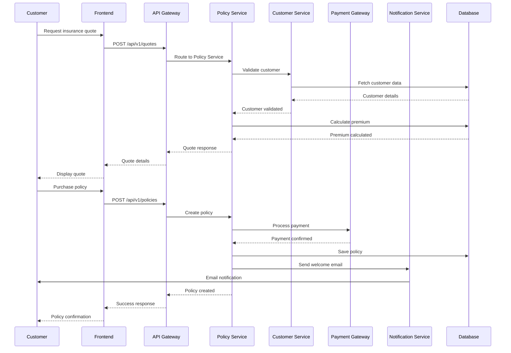
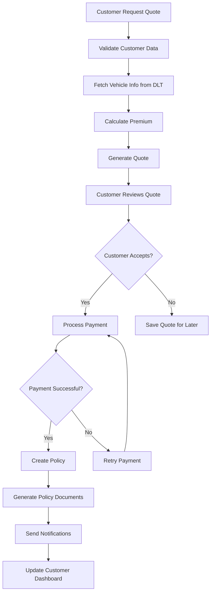
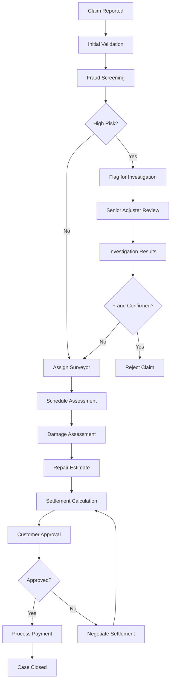

# Thai Auto Insurance System - System Design

## 1. Executive Summary

This document defines the comprehensive system design for the Thai Auto Insurance application, featuring a scalable microservices architecture built with Angular frontend and Spring Boot backend, designed to handle Thailand's specific insurance regulations and business requirements.

## 2. High-Level System Architecture

### 2.1 Architecture Overview

The system follows a **Domain-Driven Microservices Architecture** with clear separation of concerns and scalable deployment patterns.

```
┌─────────────────────────────────────────────────────────────────────────┐
│                           Load Balancer Layer                          │
│  ┌─────────────────┐  ┌─────────────────┐  ┌─────────────────────────┐ │
│  │   CloudFlare    │  │   AWS ALB/ELB   │  │   NGINX Ingress         │ │
│  │   WAF + CDN     │  │   SSL Termination│  │   Rate Limiting         │ │
│  └─────────────────┘  └─────────────────┘  └─────────────────────────┘ │
└─────────────────────────┬───────────────────────────────────────────────┘
                          │
┌─────────────────────────┴───────────────────────────────────────────────┐
│                        API Gateway Layer                               │
│  ┌─────────────────────────────────────────────────────────────────┐   │
│  │              Spring Cloud Gateway                              │   │
│  │  • Authentication & Authorization                              │   │
│  │  • Request Routing & Load Balancing                           │   │
│  │  • Rate Limiting & Circuit Breaker                            │   │
│  │  • Request/Response Transformation                            │   │
│  │  • Logging & Monitoring                                       │   │
│  └─────────────────────────────────────────────────────────────────┘   │
└─────────────┬─────────────────┬─────────────────┬─────────────────────────┘
              │                 │                 │
    ┌─────────▼─────────┐ ┌─────▼─────────┐ ┌─────▼─────────────────────┐
    │   Web Frontend    │ │  Mobile API   │ │     Admin Panel           │
    │  Angular 16+ SPA  │ │  REST/GraphQL │ │  React/Angular Admin      │
    │  PWA Enabled      │ │  iOS/Android  │ │  Role-based Access        │
    └─────────┬─────────┘ └─────┬─────────┘ └─────┬─────────────────────┘
              │                 │                 │
    ┌─────────┴─────────────────┴─────────────────┴─────────────────────┐
    │                    Microservices Layer                           │
    │                                                                   │
    │  ┌─────────────┐ ┌─────────────┐ ┌─────────────┐ ┌─────────────┐ │
    │  │   Customer  │ │   Policy    │ │   Claims    │ │  Payments   │ │
    │  │   Service   │ │   Service   │ │   Service   │ │   Service   │ │
    │  │             │ │             │ │             │ │             │ │
    │  │ • Profile   │ │ • Quotes    │ │ • Reporting │ │ • Gateway   │ │
    │  │ • Auth      │ │ • Purchase  │ │ • Processing│ │ • Methods   │ │
    │  │ • KYC       │ │ • Renewal   │ │ • Tracking  │ │ • Billing   │ │
    │  └─────────────┘ └─────────────┘ └─────────────┘ └─────────────┘ │
    │                                                                   │
    │  ┌─────────────┐ ┌─────────────┐ ┌─────────────┐ ┌─────────────┐ │
    │  │Notification │ │  Reporting  │ │Integration  │ │  Document   │ │
    │  │  Service    │ │   Service   │ │   Service   │ │   Service   │ │
    │  │             │ │             │ │             │ │             │ │
    │  │ • Email     │ │ • Analytics │ │ • DLT APIs  │ │ • Generation│ │
    │  │ • SMS       │ │ • Dashboard │ │ • Bank APIs │ │ • Storage   │ │
    │  │ • Push      │ │ • Compliance│ │ • Gov APIs  │ │ • Templates │ │
    │  └─────────────┘ └─────────────┘ └─────────────┘ └─────────────┘ │
    └─────────────────────┬───────────────────────────────────────────────┘
                          │
    ┌─────────────────────┴───────────────────────────────────────────────┐
    │                      Message Bus Layer                             │
    │  ┌─────────────────────────────────────────────────────────────┐   │
    │  │                 Apache Kafka                                │   │
    │  │  • Event Streaming                                          │   │
    │  │  • Audit Logging                                            │   │
    │  │  • Integration Events                                       │   │
    │  └─────────────────────────────────────────────────────────────┘   │
    │  ┌─────────────────────────────────────────────────────────────┐   │
    │  │                  Redis Pub/Sub                             │   │
    │  │  • Real-time Notifications                                  │   │
    │  │  • Session Management                                       │   │
    │  │  • Cache Layer                                              │   │
    │  └─────────────────────────────────────────────────────────────┘   │
    └─────────────────────┬───────────────────────────────────────────────┘
                          │
    ┌─────────────────────┴───────────────────────────────────────────────┐
    │                       Data Layer                                   │
    │                                                                     │
    │  ┌─────────────┐ ┌─────────────┐ ┌─────────────┐ ┌─────────────┐   │
    │  │ PostgreSQL  │ │ PostgreSQL  │ │ PostgreSQL  │ │ PostgreSQL  │   │
    │  │ Customer DB │ │ Policy DB   │ │ Claims DB   │ │ Payments DB │   │
    │  │ (Primary)   │ │ (Primary)   │ │ (Primary)   │ │ (Primary)   │   │
    │  └─────────────┘ └─────────────┘ └─────────────┘ └─────────────┘   │
    │                                                                     │
    │  ┌─────────────┐ ┌─────────────┐ ┌─────────────┐ ┌─────────────┐   │
    │  │   Redis     │ │ Elasticsearch│ │   AWS S3    │ │  InfluxDB   │   │
    │  │ (Cache)     │ │ (Search)    │ │ (Documents) │ │ (Metrics)   │   │
    │  └─────────────┘ └─────────────┘ └─────────────┘ └─────────────┘   │
    └─────────────────────────────────────────────────────────────────────┘
```

### 2.2 Component Interaction Flow



## 3. Microservices Breakdown

### 3.1 Customer Management Service

**Responsibilities:**
- User registration and authentication
- Profile management
- KYC (Know Your Customer) verification
- Thai national ID validation
- Document management

**Key Features:**
- OAuth2/JWT authentication
- Multi-factor authentication (SMS OTP)
- Thai national ID format validation
- Address validation with Thai postal codes
- Document upload and verification
- PDPA compliance for data protection

**Technology Stack:**
- Spring Boot 3.0+
- Spring Security with JWT
- PostgreSQL for user data
- Redis for session management
- AWS S3 for document storage

### 3.2 Policy Management Service

**Responsibilities:**
- Insurance quotation calculation
- Policy creation and management
- Policy renewal processing
- Premium calculation engine
- Coverage management

**Key Features:**
- Thai insurance regulation compliance (CMI, Voluntary classes)
- Dynamic premium calculation based on:
  - Vehicle age, type, engine size
  - Driver age and experience
  - Location-based risk factors
  - No-claim discount history
- Multi-year policy support
- Automated renewal notifications

**Business Logic:**
```java
// Premium calculation example
public class ThaiMotorInsurancePremiumCalculator {
    
    public Premium calculatePremium(Vehicle vehicle, Driver driver, 
                                   CoverageType coverage, Location location) {
        
        // Base premium by vehicle type
        BigDecimal basePremium = getBasePremium(vehicle.getType(), vehicle.getEngineSize());
        
        // Age factor (vehicle depreciation)
        BigDecimal ageFactor = calculateAgeFactor(vehicle.getYearOfManufacture());
        
        // Location risk factor (Bangkok vs provinces)
        BigDecimal locationFactor = getLocationRiskFactor(location.getProvinceCode());
        
        // Driver experience factor
        BigDecimal driverFactor = calculateDriverFactor(driver.getAge(), 
                                                       driver.getDrivingExperience());
        
        // No-claim discount (0-50% based on claims history)
        BigDecimal ncdFactor = calculateNoClaimDiscount(driver.getClaimsHistory());
        
        // Coverage type adjustment
        BigDecimal coverageFactor = getCoverageFactor(coverage);
        
        BigDecimal totalPremium = basePremium
            .multiply(ageFactor)
            .multiply(locationFactor)
            .multiply(driverFactor)
            .multiply(ncdFactor)
            .multiply(coverageFactor);
            
        // Add mandatory fees (OIC fund, tax)
        totalPremium = totalPremium.add(calculateMandatoryFees(totalPremium));
        
        return Premium.builder()
            .basePremium(basePremium)
            .totalPremium(totalPremium)
            .factors(PremiumFactors.builder()
                .ageFactor(ageFactor)
                .locationFactor(locationFactor)
                .driverFactor(driverFactor)
                .ncdFactor(ncdFactor)
                .build())
            .build();
    }
}
```

### 3.3 Claims Management Service

**Responsibilities:**
- Claims reporting and tracking
- Digital damage assessment
- Surveyor assignment
- Settlement processing
- Fraud detection

**Key Features:**
- 24/7 claims reporting
- Photo/video evidence upload
- GPS location capture
- Integration with approved repair shops
- Automated surveyor assignment
- Real-time claim status tracking
- Fraud pattern detection

**Workflow Engine:**
```java
@Component
public class ClaimsProcessingWorkflow {
    
    @Autowired
    private SurveyorService surveyorService;
    
    @Autowired
    private FraudDetectionService fraudDetectionService;
    
    @EventListener
    public void handleClaimReported(ClaimReportedEvent event) {
        Claim claim = event.getClaim();
        
        // Initial validation
        validateClaim(claim);
        
        // Fraud screening
        FraudScore fraudScore = fraudDetectionService.assessClaim(claim);
        
        if (fraudScore.isHighRisk()) {
            claim.flagForInvestigation();
            assignToSeniorAdjuster(claim);
        } else {
            // Normal processing
            assignSurveyor(claim);
        }
        
        // Notify customer
        notificationService.sendClaimConfirmation(claim);
    }
    
    private void assignSurveyor(Claim claim) {
        List<Surveyor> availableSurveyors = surveyorService
            .findAvailableSurveyors(claim.getLocation(), claim.getClaimType());
            
        Surveyor bestMatch = surveyorService.selectBestMatch(availableSurveyors, claim);
        
        surveyorService.assignClaim(bestMatch, claim);
    }
}
```

### 3.4 Payment Processing Service

**Responsibilities:**
- Multiple Thai payment methods support
- Installment plan management
- Payment gateway integration
- Billing and invoicing
- Refund processing

**Supported Payment Methods:**
- Credit/Debit cards (Visa, MasterCard, JCB)
- Thai digital wallets (TrueMoney, Rabbit LINE Pay, K-Plus)
- Bank transfers (PromptPay, internet banking)
- Installment plans (6/12 months)

**Payment Gateway Integration:**
```java
@Service
public class ThaiPaymentGatewayService {
    
    private final Map<PaymentMethod, PaymentProcessor> processors;
    
    @PostConstruct
    public void initializeProcessors() {
        processors.put(CREDIT_CARD, new TwoCTwoPProcessor(twoCTwoPConfig));
        processors.put(PROMPTPAY, new PromptPayProcessor(promptPayConfig));
        processors.put(TRUEMONEY, new TrueMoneyProcessor(trueMoneyConfig));
        processors.put(RABBIT_LINE_PAY, new RabbitLinePayProcessor(rabbitConfig));
        processors.put(BANK_TRANSFER, new InternetBankingProcessor(bankingConfig));
    }
    
    public PaymentResult processPayment(PaymentRequest request) {
        PaymentProcessor processor = processors.get(request.getPaymentMethod());
        
        if (processor == null) {
            throw new UnsupportedPaymentMethodException(request.getPaymentMethod());
        }
        
        // Add Thai-specific validations
        validateThaiPaymentRegulations(request);
        
        // Process payment with retry logic
        return executeWithRetry(() -> processor.processPayment(request));
    }
    
    private void validateThaiPaymentRegulations(PaymentRequest request) {
        // Bank of Thailand compliance checks
        if (request.getAmount().compareTo(new BigDecimal("2000000")) > 0) {
            // High-value transaction reporting
            reportToAntiMoneyLaunderingAuthority(request);
        }
        
        // Foreign currency handling
        if (!request.getCurrency().equals("THB")) {
            validateForeignExchangeCompliance(request);
        }
    }
}
```

### 3.5 Integration Service

**Responsibilities:**
- Government API integrations (DLT vehicle verification)
- Bank API integrations
- Third-party service management
- Webhook handling
- External data synchronization

**DLT Integration:**
```java
@Component
public class DLTIntegrationService {
    
    @Retryable(value = {DLTServiceException.class}, maxAttempts = 3)
    public VehicleVerificationResult verifyVehicle(String registrationNumber) {
        
        DLTApiRequest request = DLTApiRequest.builder()
            .registrationNumber(registrationNumber)
            .apiKey(dltConfig.getApiKey())
            .timestamp(Instant.now())
            .build();
            
        // Add digital signature for authentication
        String signature = cryptoService.signRequest(request);
        request.setSignature(signature);
        
        try {
            DLTApiResponse response = dltApiClient.verifyVehicle(request);
            
            return VehicleVerificationResult.builder()
                .isValid(response.isRegistrationValid())
                .vehicleDetails(mapVehicleDetails(response))
                .expiryDate(response.getRegistrationExpiry())
                .build();
                
        } catch (DLTApiException e) {
            logger.error("DLT API call failed for registration: {}", registrationNumber, e);
            throw new VehicleVerificationException("Unable to verify vehicle", e);
        }
    }
}
```

### 3.6 Notification Service

**Responsibilities:**
- Multi-channel notifications (email, SMS, push)
- Template management
- Delivery tracking
- Thai language localization
- Compliance with privacy regulations

**Features:**
- Thai mobile operator integration
- Email templates in Thai/English
- Push notifications for mobile app
- Delivery status tracking
- Opt-out management (PDPA compliance)

## 4. Data Flow Architecture

### 4.1 Policy Purchase Flow



### 4.2 Claims Processing Flow



## 5. Deployment Architecture

### 5.1 Cloud Infrastructure (AWS)

```yaml
# Infrastructure Components
Production Environment:
  - Region: Asia Pacific (Singapore) - ap-southeast-1
  - Availability Zones: 3 AZs for high availability
  - VPC: Dedicated VPC with public/private subnets
  
Compute:
  - EKS Cluster: Kubernetes 1.27+
  - Node Groups: 
    - General Purpose: m5.large (3-10 nodes)
    - Memory Optimized: r5.xlarge (2-5 nodes for databases)
    - Spot Instances: Mixed instance types for cost optimization
    
Storage:
  - RDS PostgreSQL: Multi-AZ deployment
  - ElastiCache Redis: Cluster mode enabled
  - S3: Document storage with lifecycle policies
  - EFS: Shared file system for application logs
  
Networking:
  - Application Load Balancer: HTTPS termination
  - CloudFront CDN: Global content distribution
  - Route 53: DNS management with health checks
  - WAF: Web application firewall protection
```

### 5.2 Kubernetes Cluster Configuration

```yaml
# EKS Cluster Configuration
apiVersion: eksctl.io/v1alpha5
kind: ClusterConfig

metadata:
  name: auto-insurance-prod
  region: ap-southeast-1
  version: "1.27"

vpc:
  enableDnsHostnames: true
  enableDnsSupport: true
  cidr: "10.0.0.0/16"

nodeGroups:
  - name: general-purpose
    instanceType: m5.large
    minSize: 3
    maxSize: 10
    desiredCapacity: 5
    volumeSize: 100
    volumeType: gp3
    labels:
      workload-type: general
    tags:
      Environment: production
      Application: auto-insurance
    
  - name: memory-optimized
    instanceType: r5.xlarge
    minSize: 2
    maxSize: 5
    desiredCapacity: 2
    volumeSize: 200
    volumeType: gp3
    labels:
      workload-type: database
    taints:
      - key: workload-type
        value: database
        effect: NoSchedule

addons:
  - name: vpc-cni
    version: latest
  - name: coredns
    version: latest
  - name: kube-proxy
    version: latest
  - name: aws-ebs-csi-driver
    version: latest

cloudWatch:
  clusterLogging:
    enableTypes: ["*"]
```

### 5.3 Service Deployment Configuration

```yaml
# Backend Service Deployment
apiVersion: apps/v1
kind: Deployment
metadata:
  name: policy-service
  namespace: auto-insurance
spec:
  replicas: 3
  strategy:
    type: RollingUpdate
    rollingUpdate:
      maxSurge: 1
      maxUnavailable: 0
  selector:
    matchLabels:
      app: policy-service
  template:
    metadata:
      labels:
        app: policy-service
    spec:
      containers:
      - name: policy-service
        image: auto-insurance/policy-service:latest
        ports:
        - containerPort: 8080
        env:
        - name: SPRING_PROFILES_ACTIVE
          value: "kubernetes,production"
        - name: DATABASE_URL
          valueFrom:
            secretKeyRef:
              name: database-secret
              key: policy-db-url
        - name: REDIS_URL
          valueFrom:
            secretKeyRef:
              name: redis-secret
              key: redis-url
        resources:
          requests:
            memory: "512Mi"
            cpu: "250m"
          limits:
            memory: "2Gi"
            cpu: "1000m"
        livenessProbe:
          httpGet:
            path: /actuator/health/liveness
            port: 8080
          initialDelaySeconds: 60
          periodSeconds: 30
        readinessProbe:
          httpGet:
            path: /actuator/health/readiness
            port: 8080
          initialDelaySeconds: 30
          periodSeconds: 10
        volumeMounts:
        - name: application-config
          mountPath: /config
          readOnly: true
      volumes:
      - name: application-config
        configMap:
          name: policy-service-config
      affinity:
        podAntiAffinity:
          preferredDuringSchedulingIgnoredDuringExecution:
          - weight: 100
            podAffinityTerm:
              labelSelector:
                matchExpressions:
                - key: app
                  operator: In
                  values:
                  - policy-service
              topologyKey: kubernetes.io/hostname
```

## 6. Security Architecture

### 6.1 Defense in Depth Strategy

```
┌─────────────────────────────────────────────────────────────────┐
│                    Security Layer 1: Perimeter                 │
│  ┌─────────────────────────────────────────────────────────┐   │
│  │  CloudFlare WAF + DDoS Protection                      │   │
│  │  • Rate limiting: 1000 req/min per IP                  │   │
│  │  • Geo-blocking: Allow Thailand + major countries      │   │
│  │  │  • Bot protection and challenge-response            │   │
│  │  • SSL/TLS termination (TLS 1.3)                       │   │
│  └─────────────────────────────────────────────────────────┘   │
└─────────────────────┬───────────────────────────────────────────┘
                      │
┌─────────────────────┴───────────────────────────────────────────┐
│                    Security Layer 2: Network                   │
│  ┌─────────────────────────────────────────────────────────┐   │
│  │  VPC Network Isolation                                  │   │
│  │  • Private subnets for backend services                 │   │
│  │  • Public subnets only for load balancers              │   │
│  │  • Security groups with least privilege                │   │
│  │  • Network ACLs for additional protection              │   │
│  │  • VPN gateway for admin access                        │   │
│  └─────────────────────────────────────────────────────────┘   │
└─────────────────────┬───────────────────────────────────────────┘
                      │
┌─────────────────────┴───────────────────────────────────────────┐
│                 Security Layer 3: Application                  │
│  ┌─────────────────────────────────────────────────────────┐   │
│  │  API Gateway Security                                   │   │
│  │  • OAuth 2.0 / JWT authentication                       │   │
│  │  • API rate limiting per user                          │   │
│  │  • Request/response validation                         │   │
│  │  • Circuit breaker pattern                             │   │
│  └─────────────────────────────────────────────────────────┘   │
│  ┌─────────────────────────────────────────────────────────┐   │
│  │  Microservice Security                                  │   │
│  │  • mTLS between services                                │   │
│  │  • Role-based access control (RBAC)                    │   │
│  │  • Input validation and sanitization                   │   │
│  │  • SQL injection prevention                            │   │
│  │  • XSS protection                                       │   │
│  └─────────────────────────────────────────────────────────┘   │
└─────────────────────┬───────────────────────────────────────────┘
                      │
┌─────────────────────┴───────────────────────────────────────────┐
│                   Security Layer 4: Data                       │
│  ┌─────────────────────────────────────────────────────────┐   │
│  │  Data Protection                                        │   │
│  │  • Encryption at rest (AES-256)                        │   │
│  │  • Encryption in transit (TLS 1.3)                     │   │
│  │  • Field-level encryption for sensitive data           │   │
│  │  • Key management with AWS KMS                         │   │
│  │  • Database access controls                            │   │
│  │  • Data masking for non-production                     │   │
│  └─────────────────────────────────────────────────────────┘   │
└─────────────────────────────────────────────────────────────────┘
```

### 6.2 Authentication and Authorization

```java
// JWT Configuration
@Configuration
@EnableWebSecurity
public class JWTSecurityConfig {
    
    @Bean
    public SecurityFilterChain filterChain(HttpSecurity http) throws Exception {
        return http
            .csrf(csrf -> csrf.disable())
            .sessionManagement(session -> 
                session.sessionCreationPolicy(SessionCreationPolicy.STATELESS))
            .authorizeHttpRequests(auth -> auth
                // Public endpoints
                .requestMatchers("/api/v1/auth/**").permitAll()
                .requestMatchers("/api/v1/public/**").permitAll()
                .requestMatchers("/actuator/health").permitAll()
                
                // Customer endpoints
                .requestMatchers("/api/v1/customers/**")
                    .hasAnyRole("CUSTOMER", "AGENT", "ADMIN")
                .requestMatchers(HttpMethod.GET, "/api/v1/policies/**")
                    .hasAnyRole("CUSTOMER", "AGENT", "ADMIN")
                .requestMatchers(HttpMethod.POST, "/api/v1/policies")
                    .hasAnyRole("CUSTOMER", "AGENT")
                    
                // Agent endpoints
                .requestMatchers("/api/v1/agents/**").hasAnyRole("AGENT", "ADMIN")
                
                // Admin endpoints
                .requestMatchers("/api/v1/admin/**").hasRole("ADMIN")
                .requestMatchers("/api/v1/reports/**").hasRole("ADMIN")
                
                .anyRequest().authenticated())
                
            .oauth2ResourceServer(oauth2 -> 
                oauth2.jwt(jwt -> jwt.jwtDecoder(jwtDecoder())))
                
            .exceptionHandling(ex -> ex
                .authenticationEntryPoint(customAuthenticationEntryPoint())
                .accessDeniedHandler(customAccessDeniedHandler()))
            .build();
    }
    
    // Thai-specific security validations
    @PreAuthorize("@securityService.canAccessCustomerData(#customerId, authentication)")
    @GetMapping("/customers/{customerId}/policies")
    public ResponseEntity<List<PolicyDto>> getCustomerPolicies(
            @PathVariable UUID customerId) {
        return ResponseEntity.ok(policyService.getCustomerPolicies(customerId));
    }
}

// Security Service for complex authorization logic
@Service
public class SecurityService {
    
    public boolean canAccessCustomerData(UUID customerId, Authentication authentication) {
        String role = authentication.getAuthorities().iterator().next().getAuthority();
        
        switch (role) {
            case "ROLE_ADMIN":
                return true; // Admins can access all customer data
                
            case "ROLE_AGENT":
                // Agents can only access their assigned customers
                UUID agentId = UUID.fromString(authentication.getName());
                return customerService.isAgentAssigned(customerId, agentId);
                
            case "ROLE_CUSTOMER":
                // Customers can only access their own data
                UUID authenticatedCustomerId = UUID.fromString(authentication.getName());
                return customerId.equals(authenticatedCustomerId);
                
            default:
                return false;
        }
    }
}
```

### 6.3 Data Protection (PDPA Compliance)

```java
// Data protection annotations and services
@Entity
@Table(name = "customers")
@JsonFilter("customerDataFilter")
public class Customer extends AuditableEntity {
    
    @Id
    private UUID id;
    
    private String firstName;
    private String lastName;
    
    @Column(name = "email")
    @PersonalData
    private String email;
    
    @Column(name = "phone_number")
    @PersonalData
    @Encrypted
    private String phoneNumber;
    
    @Column(name = "national_id")
    @SensitivePersonalData
    @Encrypted
    private String nationalId;
    
    @Embedded
    @PersonalData
    private Address address;
    
    // PDPA consent tracking
    @OneToMany(mappedBy = "customer", cascade = CascadeType.ALL)
    private List<ConsentRecord> consentRecords;
    
    // Data subject rights implementation
    public PersonalDataExportDto exportPersonalData() {
        // Implementation for data portability (Article 28 PDPA)
    }
    
    public void anonymizePersonalData() {
        // Implementation for right to erasure (Article 30 PDPA)
    }
}

@Service
public class PDPAComplianceService {
    
    // Data processing audit trail
    public void logDataProcessing(String purpose, String legalBasis, 
                                 Set<String> dataCategories, UUID customerId) {
        DataProcessingLog log = DataProcessingLog.builder()
            .purpose(purpose)
            .legalBasis(legalBasis)
            .dataCategories(dataCategories)
            .customerId(customerId)
            .timestamp(Instant.now())
            .build();
            
        dataProcessingLogRepository.save(log);
    }
    
    // Consent management
    public boolean hasValidConsent(UUID customerId, String purpose) {
        return consentRepository.findByCustomerIdAndPurpose(customerId, purpose)
            .map(consent -> consent.isValid() && !consent.isWithdrawn())
            .orElse(false);
    }
    
    // Data retention policy enforcement
    @Scheduled(cron = "0 0 2 * * *") // Run daily at 2 AM
    public void enforceDataRetention() {
        List<Customer> customersForDeletion = customerRepository
            .findCustomersEligibleForDeletion(Instant.now().minus(Duration.ofDays(2555))); // 7 years
            
        customersForDeletion.forEach(this::anonymizeCustomerData);
    }
}
```

## 7. Performance and Scalability

### 7.1 Horizontal Scaling Strategy

```yaml
# Horizontal Pod Autoscaler Configuration
apiVersion: autoscaling/v2
kind: HorizontalPodAutoscaler
metadata:
  name: policy-service-hpa
spec:
  scaleTargetRef:
    apiVersion: apps/v1
    kind: Deployment
    name: policy-service
  minReplicas: 3
  maxReplicas: 20
  metrics:
  - type: Resource
    resource:
      name: cpu
      target:
        type: Utilization
        averageUtilization: 70
  - type: Resource
    resource:
      name: memory
      target:
        type: Utilization
        averageUtilization: 80
  - type: Pods
    pods:
      metric:
        name: active_requests_per_pod
      target:
        type: AverageValue
        averageValue: "100"
  behavior:
    scaleUp:
      stabilizationWindowSeconds: 60
      policies:
      - type: Percent
        value: 50
        periodSeconds: 60
    scaleDown:
      stabilizationWindowSeconds: 300
      policies:
      - type: Percent
        value: 10
        periodSeconds: 60
```

### 7.2 Caching Strategy

```java
// Multi-level caching implementation
@Configuration
@EnableCaching
public class CacheConfiguration {
    
    @Bean
    public CacheManager cacheManager() {
        RedisCacheManager.Builder builder = RedisCacheManager
            .RedisCacheManagerBuilder
            .fromConnectionFactory(redisConnectionFactory())
            .cacheDefaults(cacheConfiguration());
            
        // Configure different cache policies for different data types
        Map<String, RedisCacheConfiguration> cacheConfigurations = new HashMap<>();
        
        // Short-term cache for frequent API calls
        cacheConfigurations.put("quotes", RedisCacheConfiguration.defaultCacheConfig()
            .entryTtl(Duration.ofMinutes(15))
            .serializeKeysWith(stringRedisSerializer())
            .serializeValuesWith(jsonRedisSerializer()));
            
        // Medium-term cache for user sessions
        cacheConfigurations.put("sessions", RedisCacheConfiguration.defaultCacheConfig()
            .entryTtl(Duration.ofHours(2))
            .serializeKeysWith(stringRedisSerializer())
            .serializeValuesWith(jsonRedisSerializer()));
            
        // Long-term cache for reference data
        cacheConfigurations.put("reference-data", RedisCacheConfiguration.defaultCacheConfig()
            .entryTtl(Duration.ofHours(24))
            .serializeKeysWith(stringRedisSerializer())
            .serializeValuesWith(jsonRedisSerializer()));
            
        builder.withInitialCacheConfigurations(cacheConfigurations);
        
        return builder.build();
    }
    
    // Cache warming strategy
    @EventListener(ApplicationReadyEvent.class)
    public void warmCache() {
        // Preload frequently accessed data
        referenceDataService.loadProvinces();
        referenceDataService.loadVehicleTypes();
        referenceDataService.loadInsuranceRates();
    }
}

// Cache usage in services
@Service
public class PolicyService {
    
    @Cacheable(value = "quotes", key = "#request.customerId + '-' + #request.vehicleId")
    public QuoteDto generateQuote(QuoteRequest request) {
        // Expensive premium calculation
        return premiumCalculationService.calculatePremium(request);
    }
    
    @CacheEvict(value = "quotes", key = "#customerId + '-*'", condition = "#result.isSuccessful()")
    public PolicyDto createPolicy(CreatePolicyRequest request) {
        // Policy creation logic
        return policyRepository.save(policy);
    }
    
    // Cache-aside pattern for complex queries
    public List<PolicyDto> getCustomerPolicies(UUID customerId) {
        String cacheKey = "customer-policies:" + customerId;
        
        List<PolicyDto> cachedPolicies = redisTemplate.opsForValue().get(cacheKey);
        if (cachedPolicies != null) {
            return cachedPolicies;
        }
        
        List<PolicyDto> policies = policyRepository.findByCustomerId(customerId);
        redisTemplate.opsForValue().set(cacheKey, policies, Duration.ofHours(1));
        
        return policies;
    }
}
```

### 7.3 Database Performance Optimization

```sql
-- Performance monitoring and optimization

-- Create performance monitoring views
CREATE VIEW policy_performance_metrics AS
SELECT 
    DATE_TRUNC('hour', created_at) as hour,
    COUNT(*) as policies_created,
    AVG(EXTRACT(EPOCH FROM (updated_at - created_at))) as avg_processing_time_seconds,
    COUNT(*) FILTER (WHERE status = 'ACTIVE') as active_policies,
    COUNT(*) FILTER (WHERE status = 'EXPIRED') as expired_policies
FROM policies
WHERE created_at >= NOW() - INTERVAL '7 days'
GROUP BY DATE_TRUNC('hour', created_at)
ORDER BY hour;

-- Partitioning strategy for large tables
CREATE TABLE audit_logs_y2024m01 PARTITION OF audit_logs
FOR VALUES FROM ('2024-01-01') TO ('2024-02-01');

CREATE TABLE audit_logs_y2024m02 PARTITION OF audit_logs
FOR VALUES FROM ('2024-02-01') TO ('2024-03-01');

-- Index optimization
CREATE INDEX CONCURRENTLY idx_policies_customer_status_date 
ON policies (customer_id, status, end_date) 
WHERE status IN ('ACTIVE', 'PENDING');

CREATE INDEX CONCURRENTLY idx_claims_reporting_date 
ON claims (reported_date DESC, status) 
INCLUDE (claim_number, policy_id, estimated_amount);

-- Query optimization examples
-- Instead of this slow query:
-- SELECT * FROM policies p JOIN customers c ON p.customer_id = c.id 
-- WHERE p.end_date < NOW() AND p.status = 'ACTIVE';

-- Use this optimized version:
SELECT p.id, p.policy_number, p.end_date, 
       c.first_name, c.last_name, c.email
FROM policies p 
JOIN customers c ON p.customer_id = c.id 
WHERE p.status = 'ACTIVE' 
AND p.end_date < NOW()
AND p.end_date >= NOW() - INTERVAL '30 days'
ORDER BY p.end_date;

-- Connection pooling configuration
-- HikariCP configuration in application.yml
spring:
  datasource:
    hikari:
      maximum-pool-size: 20
      minimum-idle: 5
      connection-timeout: 30000
      idle-timeout: 600000
      max-lifetime: 1800000
      leak-detection-threshold: 60000
      
-- Read replica configuration for reporting queries
CREATE DATABASE auto_insurance_read_replica;
-- Configure replication lag monitoring
SELECT 
    client_addr, 
    state, 
    sent_lsn, 
    write_lsn, 
    flush_lsn, 
    replay_lsn,
    EXTRACT(EPOCH FROM (now() - reply_time)) as lag_seconds
FROM pg_stat_replication;
```

## 8. Disaster Recovery and Business Continuity

### 8.1 Backup and Recovery Strategy

```yaml
# Database Backup Configuration
apiVersion: batch/v1
kind: CronJob
metadata:
  name: postgres-backup
spec:
  schedule: "0 2 * * *"  # Daily at 2 AM
  jobTemplate:
    spec:
      template:
        spec:
          containers:
          - name: postgres-backup
            image: postgres:15
            command:
            - /bin/bash
            - -c
            - |
              TIMESTAMP=$(date +%Y%m%d_%H%M%S)
              pg_dump -h $POSTGRES_HOST -U $POSTGRES_USER -d $POSTGRES_DB \
                --format=custom \
                --no-owner \
                --no-privileges \
                --verbose \
                --file=/tmp/backup_${TIMESTAMP}.dump
              
              # Upload to S3
              aws s3 cp /tmp/backup_${TIMESTAMP}.dump \
                s3://auto-insurance-backups/database/backup_${TIMESTAMP}.dump
                
              # Keep only last 30 days of backups
              aws s3 ls s3://auto-insurance-backups/database/ | \
                grep backup_ | \
                sort -k1,2 | \
                head -n -30 | \
                awk '{print $4}' | \
                xargs -I {} aws s3 rm s3://auto-insurance-backups/database/{}
                
            env:
            - name: POSTGRES_HOST
              valueFrom:
                secretKeyRef:
                  name: postgres-secret
                  key: host
            - name: POSTGRES_USER
              valueFrom:
                secretKeyRef:
                  name: postgres-secret
                  key: username
            - name: POSTGRES_PASSWORD
              valueFrom:
                secretKeyRef:
                  name: postgres-secret
                  key: password
            - name: POSTGRES_DB
              valueFrom:
                secretKeyRef:
                  name: postgres-secret
                  key: database
          restartPolicy: OnFailure
```

### 8.2 Multi-Region Disaster Recovery

```yaml
# Disaster Recovery Architecture
Primary Region: ap-southeast-1 (Singapore)
DR Region: ap-southeast-2 (Sydney)

RTO (Recovery Time Objective): 4 hours
RPO (Recovery Point Objective): 1 hour

Components:
  Database:
    - Primary: RDS PostgreSQL Multi-AZ in Singapore
    - DR: Cross-region read replica in Sydney
    - Backup: Automated snapshots + manual snapshots
    
  Application:
    - Primary: EKS cluster in Singapore (3 AZs)
    - DR: EKS cluster in Sydney (cold standby)
    - Container Registry: ECR with cross-region replication
    
  Storage:
    - Primary: S3 buckets in Singapore
    - DR: S3 cross-region replication to Sydney
    - Access: CloudFront for global CDN
    
  DNS:
    - Route 53 health checks
    - Automatic failover to DR region
    - TTL: 60 seconds for rapid failover
```

## 9. Monitoring and Observability

### 9.1 Monitoring Stack

```yaml
# Prometheus Configuration
apiVersion: v1
kind: ConfigMap
metadata:
  name: prometheus-config
data:
  prometheus.yml: |
    global:
      scrape_interval: 15s
      evaluation_interval: 15s
      
    rule_files:
      - "auto_insurance_rules.yml"
      
    scrape_configs:
      - job_name: 'kubernetes-pods'
        kubernetes_sd_configs:
        - role: pod
        relabel_configs:
        - source_labels: [__meta_kubernetes_pod_annotation_prometheus_io_scrape]
          action: keep
          regex: true
          
      - job_name: 'policy-service'
        static_configs:
        - targets: ['policy-service:8080']
        metrics_path: '/actuator/prometheus'
        scrape_interval: 10s
        
      - job_name: 'customer-service'
        static_configs:
        - targets: ['customer-service:8080']
        metrics_path: '/actuator/prometheus'
        scrape_interval: 10s

---
# Custom alerting rules
apiVersion: v1
kind: ConfigMap
metadata:
  name: prometheus-rules
data:
  auto_insurance_rules.yml: |
    groups:
    - name: auto_insurance_alerts
      rules:
      - alert: HighErrorRate
        expr: rate(http_requests_total{status=~"5.."}[5m]) > 0.1
        for: 5m
        labels:
          severity: critical
        annotations:
          summary: "High error rate detected"
          description: "Error rate is {{ $value }} errors per second"
          
      - alert: PolicyCreationFailure
        expr: rate(policy_creation_failures_total[5m]) > 0.05
        for: 3m
        labels:
          severity: warning
        annotations:
          summary: "Policy creation failures detected"
          
      - alert: DatabaseConnectionsHigh
        expr: hikaricp_connections_active > 15
        for: 5m
        labels:
          severity: warning
        annotations:
          summary: "Database connection pool utilization high"
```

### 9.2 Application Metrics

```java
// Custom business metrics
@Component
public class AutoInsuranceMetrics {
    
    private final Counter policyCreatedCounter;
    private final Counter claimReportedCounter;
    private final Timer premiumCalculationTimer;
    private final Gauge activePoliciesGauge;
    private final Counter paymentProcessedCounter;
    
    public AutoInsuranceMetrics(MeterRegistry meterRegistry) {
        this.policyCreatedCounter = Counter.builder("policies.created.total")
            .description("Total number of policies created")
            .tag("type", "all")
            .register(meterRegistry);
            
        this.claimReportedCounter = Counter.builder("claims.reported.total")
            .description("Total number of claims reported")
            .register(meterRegistry);
            
        this.premiumCalculationTimer = Timer.builder("premium.calculation.time")
            .description("Time taken to calculate premium")
            .register(meterRegistry);
            
        this.activePoliciesGauge = Gauge.builder("policies.active.count")
            .description("Number of currently active policies")
            .register(meterRegistry, this, AutoInsuranceMetrics::getActivePoliciesCount);
            
        this.paymentProcessedCounter = Counter.builder("payments.processed.total")
            .description("Total payments processed")
            .register(meterRegistry);
    }
    
    public void recordPolicyCreated(PolicyType type) {
        policyCreatedCounter.increment(Tags.of("policy.type", type.name()));
    }
    
    public void recordClaimReported(ClaimType type) {
        claimReportedCounter.increment(Tags.of("claim.type", type.name()));
    }
    
    public Timer.Sample startPremiumCalculationTimer() {
        return Timer.start(meterRegistry);
    }
    
    public void recordPaymentProcessed(PaymentMethod method, BigDecimal amount) {
        paymentProcessedCounter.increment(
            Tags.of(
                "payment.method", method.name(),
                "amount.range", getAmountRange(amount)
            )
        );
    }
    
    private double getActivePoliciesCount() {
        return policyRepository.countByStatus(PolicyStatus.ACTIVE);
    }
}

// Health indicators
@Component
public class AutoInsuranceHealthIndicator implements HealthIndicator {
    
    @Autowired
    private PolicyRepository policyRepository;
    
    @Autowired
    private PaymentGatewayService paymentGatewayService;
    
    @Override
    public Health health() {
        Health.Builder builder = new Health.Builder();
        
        try {
            // Check database connectivity
            long policyCount = policyRepository.count();
            builder.up()
                .withDetail("database", "accessible")
                .withDetail("policy.count", policyCount);
                
            // Check payment gateway connectivity
            boolean paymentGatewayHealthy = paymentGatewayService.healthCheck();
            if (paymentGatewayHealthy) {
                builder.withDetail("payment.gateway", "healthy");
            } else {
                builder.down().withDetail("payment.gateway", "unhealthy");
            }
            
        } catch (Exception e) {
            builder.down()
                .withDetail("database", "inaccessible")
                .withException(e);
        }
        
        return builder.build();
    }
}
```

## 10. Conclusion

This system design provides a robust, scalable, and secure foundation for the Thai Auto Insurance application. The architecture addresses:

### Key Strengths:
1. **Regulatory Compliance**: Full compliance with Thai insurance regulations and PDPA
2. **Scalability**: Microservices architecture with horizontal scaling capabilities
3. **Security**: Multi-layered security with encryption, authentication, and audit trails
4. **Performance**: Optimized database design, caching strategies, and CDN integration
5. **Resilience**: Circuit breakers, retries, and disaster recovery procedures
6. **Observability**: Comprehensive monitoring, logging, and alerting

### Technical Excellence:
- Modern technology stack (Angular 16+, Spring Boot 3.0+, PostgreSQL 14+)
- Cloud-native deployment with Kubernetes
- DevOps best practices with CI/CD pipelines
- Comprehensive testing strategy
- Documentation and knowledge management

### Business Value:
- Reduced operational costs through automation
- Improved customer experience with digital-first approach
- Faster time-to-market for new features
- Enhanced regulatory compliance and audit capabilities
- Scalability to support business growth

The architecture is designed to evolve with changing business requirements while maintaining stability and performance standards required for a mission-critical insurance platform.

---

**Document Version**: 1.0  
**Last Updated**: 2024-12-27  
**Next Review**: 2025-03-27  
**Approved By**: System Architecture Team